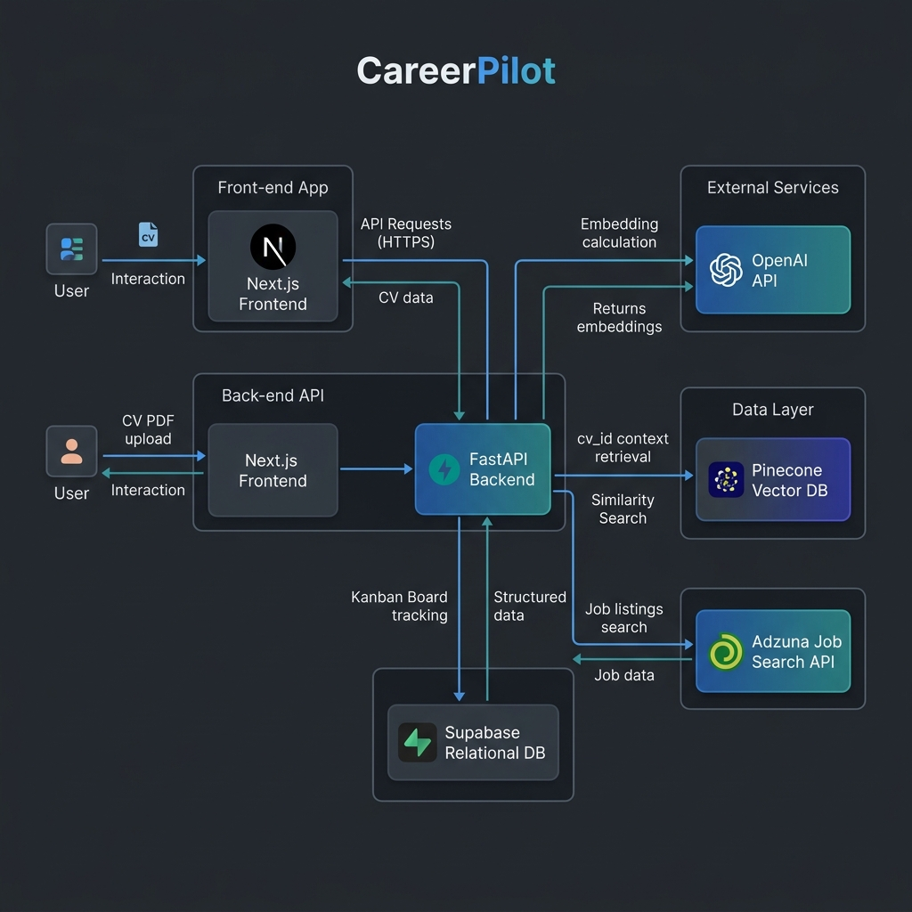

# CareerPilot

CareerPilot is an AI-powered job search engine and application tracker designed to optimize your job application workflow. By integrating real-time job listings, automated CV-matching fit scores, and dynamic task tracking, CareerPilot provides job seekers with a streamlined, intelligent portal. The application is built on four core pillars:
1. **Job Hunter Agent**: Live external job searches fetching structured, parsed job postings.
2. **Fit Score Engine**: Programmatic cosine similarity scoring of candidate resumes against job descriptions.
3. **Application Tracker**: A Kanban board interface with active logging, calendar visualization, and goal/todo coordination.
4. **AI Nudge & Dashboard**: Smart notifications that identify application inactivity and suggest matching vacancies, combined with visualization stats.

---

## Live Demo

- **Frontend**: Run locally — `cd frontend && npm run dev`
- **Backend API**: Run locally — `cd backend && python -m uvicorn main:app --reload`
- **Demo Video walkthrough**: *(Placeholder)*

---

## System Architecture

The following diagram illustrates the components and data flows of the CareerPilot system:



* **User Interaction**: Users upload CVs and search for jobs on the Next.js Frontend.
* **Frontend-Backend API**: Next.js communicates with the FastAPI Backend to fetch and modify job listings, tracking items, and system dashboard statistics.
* **External Integrations**:
  * **OpenAI API**: Computes embeddings for job descriptions and extracts structured reasons for fit scores.
  * **Adzuna API**: Fetches live, external job vacancies.
  * **Pinecone Vector DB**: Performs similarity index retrieval for CV contents.
  * **Supabase / SQLite**: Stores user activity logs, applications, goals, and todos.

---

## Tech Stack

| Component | Technology | Description |
|-----------|------------|-------------|
| **Frontend** | Next.js 14, TailwindCSS, shadcn/ui | Modern, responsive, interactive UI |
| **Backend** | FastAPI, Python 3.12 | High-performance, asynchronous REST API |
| **Vector DB** | Pinecone | Core similarity index for CV embeddings |
| **Database** | Supabase (PostgreSQL) / SQLite | Relational database with SQLAlchemy ORM |
| **LLM & Embeddings** | OpenAI (GPT-4o-mini, text-embedding-3-small) / Gemini | RAG text embedding and reasons generation |
| **Hosting** | Self-hosted (Vercel/Railway/Render optional) | Production environment hosting |

---

## Local Setup

### Prerequisites
* Python 3.12+
* Node.js 18+

### Step 1: Clone and Configure Environment
1. Clone the repository to your local system.
2. Navigate to the project root and copy the example environment file:
   ```bash
   cp .env.example .env
   ```
3. Open the newly created `.env` file and fill in your respective API keys.

### Step 2: Backend Setup
1. Navigate to the `backend/` directory:
   ```bash
   cd backend
   ```
2. Install the required dependencies:
   ```bash
   pip install -r requirements.txt
   ```
3. Run the backend development server:
   ```bash
   uvicorn main:app --reload
   ```
4. Access backend docs locally at `http://127.0.0.1:8000/docs`.

### Step 3: Frontend Setup
1. Navigate to the `frontend/` directory (if available):
   ```bash
   cd ../frontend
   ```
2. Install dependencies:
   ```bash
   npm install
   ```
3. Start the Next.js development server:
   ```bash
   npm run dev
   ```
4. Access the portal locally at `http://localhost:3000`.

---

## Required Environment Variables

| Variable Name | Description | Source |
|---------------|-------------|--------|
| `ADZUNA_APP_ID` | Application ID for Job Vacancies API | [Adzuna Developer Portal](https://developer.adzuna.com/) |
| `ADZUNA_APP_KEY` | Developer Application Access Key | [Adzuna Developer Portal](https://developer.adzuna.com/) |
| `PINECONE_API_KEY` | Vector DB API credentials | [Pinecone Console](https://console.pinecone.io/) |
| `PINECONE_INDEX` | Pinecone Index Name (defaults to `careerpilot-cv`) | [Pinecone Console](https://console.pinecone.io/) |
| `PINECONE_ENV` | Region/Environment of the Pinecone index | [Pinecone Console](https://console.pinecone.io/) |
| `SUPABASE_URL` | Supabase endpoint URL for production | [Supabase Dashboard](https://supabase.com/) |
| `SUPABASE_ANON_KEY` | Supabase public API Key | [Supabase Dashboard](https://supabase.com/) |
| `OPENAI_API_KEY` | Primary embedding generation and LLM keys | [OpenAI API Console](https://platform.openai.com/) |
| `GEMINI_API_KEY` | Secondary fallback embedding and LLM keys | [Google AI Studio](https://aistudio.google.com/) |

---

## Running Tests

To run all unit, router, and integration tests, run the following commands from the project root:

```powershell
# Set Python path to look up backend modules
$env:PYTHONPATH = "C:\Career Pilot"

# Execute all tests using pytest
C:\Users\monta\AppData\Local\Programs\Python\Python312\python.exe -m pytest backend/tests/ -v
```

---

## Team

| Member | Focus | Ownership Area |
|--------|-------|----------------|
| **Member A** | AI Layer | PDF upload parsing, Gemini LLM text processing, RAG pipelines, resume optimization endpoint |
| **Member B** | Frontend | Kanban Board interface, Calendar widgets, analytics dashboard UI components |
| **Member C** | Integrations & Tracker | Job Hunter Agent, Cosine Fit Score, Kanban / To-Dos / Goals / Stats routers, Deployment setups |
