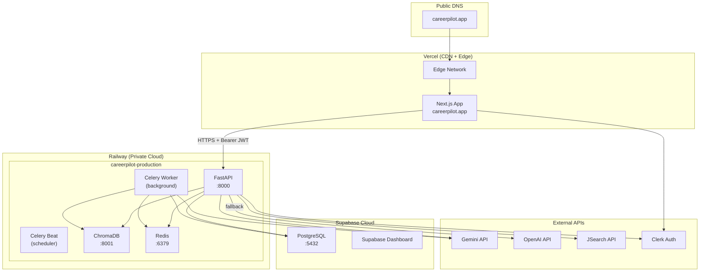
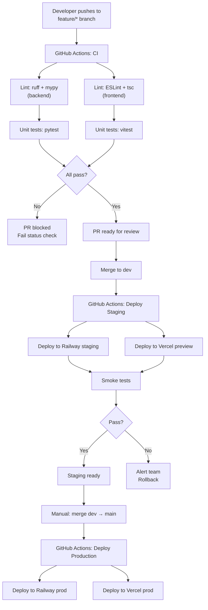

# FILE: integrations-tracker-deployment-spec.md

**Purpose:** Complete specification for all external service integrations, infrastructure architecture, deployment pipelines, monitoring, analytics, DevOps tooling, and operational runbooks.

**Scope:** Everything outside `backend/` and `frontend/` that the system depends on — cloud platforms, CI/CD, external APIs, secrets management, observability, and reliability engineering.

**Dependencies:** Integrations are consumed by the backend layer (`backend-ai-spec.md`). Deployment targets are determined by the architecture in `master-spec.md § 3` and environment strategy in `master-spec.md § 10`.

---

## Table of Contents

1. [External Integrations](#1-external-integrations)
2. [Infrastructure Architecture](#2-infrastructure-architecture)
3. [Deployment Architecture](#3-deployment-architecture)
4. [Monitoring & Observability](#4-monitoring--observability)
5. [Analytics & Tracking](#5-analytics--tracking)
6. [DevOps Tooling](#6-devops-tooling)
7. [Environment Configuration](#7-environment-configuration)
8. [Reliability Engineering](#8-reliability-engineering)
9. [Security Operations](#9-security-operations)
10. [Cost Optimization](#10-cost-optimization)
11. [Release Management](#11-release-management)
12. [Project Tracking System](#12-project-tracking-system)
13. [Operational Runbooks](#13-operational-runbooks)
14. [Deployment File Structure](#14-deployment-file-structure)

---

## 1. External Integrations

### 1.1 Gemini API (Primary LLM)

| Property | Value |
|----------|-------|
| Provider | Google AI Studio / Vertex AI |
| Auth | API Key (`GEMINI_API_KEY`) in request header |
| Primary endpoint | `https://generativelanguage.googleapis.com/v1beta/models/gemini-1.5-flash:generateContent` |
| Pro endpoint | `https://generativelanguage.googleapis.com/v1beta/models/gemini-1.5-pro:generateContent` |
| Free tier limits | 15 RPM (flash), 2 RPM (pro); 1M tokens/day |
| Rate limit handling | Exponential backoff: 2s, 4s, 8s, then fallback to OpenAI |
| Timeout | 30 seconds per request |
| Cost (paid) | Flash: $0.075/1M input tokens; Pro: $1.25/1M input tokens |

**Integration pattern:**

```python
# services/llm_client.py
import google.generativeai as genai
from tenacity import retry, stop_after_attempt, wait_exponential

genai.configure(api_key=os.getenv("GEMINI_API_KEY"))

@retry(stop=stop_after_attempt(3), wait=wait_exponential(min=2, max=30))
async def call_gemini(
    prompt: str,
    model: str = "gemini-1.5-flash",
    max_tokens: int = 1000,
    temperature: float = 0.3
) -> str:
    model_client = genai.GenerativeModel(model)
    response = await model_client.generate_content_async(
        prompt,
        generation_config=genai.GenerationConfig(
            max_output_tokens=max_tokens,
            temperature=temperature,
        )
    )
    return response.text

# Failure handling
class GeminiRateLimitError(Exception): pass
class GeminiUnavailableError(Exception): pass
```

**Retry logic:** On HTTP 429 (rate limit) → wait and retry up to 3 times → then call OpenAI fallback. On HTTP 500/503 → circuit breaker trips after 5 failures in 60 seconds.

---

### 1.2 OpenAI API (LLM Fallback)

| Property | Value |
|----------|-------|
| Provider | OpenAI |
| Auth | API Key (`OPENAI_API_KEY`) |
| Primary model | `gpt-4o-mini` (chat/simple tasks) |
| Heavy tasks model | `gpt-4o` (roadmap, cover letter) |
| Embedding model | `text-embedding-3-small` (1536 dims, fallback to sentence-transformers) |
| Rate limits | Tier 1: 500 RPM, 30,000 TPM |
| Cost | `gpt-4o-mini`: $0.15/1M input; `gpt-4o`: $2.50/1M input |

**Used only when:** Gemini API returns an error after retries, or Gemini circuit breaker is open.

---

### 1.3 JSearch API (Job Search)

| Property | Value |
|----------|-------|
| Provider | openwebninja.com — JSearch |
| Auth | `x-api-key` header (`JSEARCH_API_KEY`) |
| Base URL | `https://api.openwebninja.com/jsearch/search-v2` |
| Free tier | 200 requests/month |
| Rate limit | 10 requests/second |
| Timeout | 10 seconds |

**Request example:**

```python
# integrations/job_hunter.py
import httpx

JSEARCH_HEADERS = {
    "x-api-key": os.getenv("JSEARCH_API_KEY"),
}

async def search_jobs(query: str, location: str = "", num_pages: int = 1) -> list[dict]:
    params = {
        "query": f"{query} {location}".strip(),
        "page": "1",
        "num_pages": str(num_pages),
        "date_posted": "month",
    }
    async with httpx.AsyncClient(timeout=10.0) as client:
        response = await client.get(
            "https://api.openwebninja.com/jsearch/search-v2",
            headers=JSEARCH_HEADERS,
            params=params
        )
        response.raise_for_status()
        data = response.json()
        return [parse_jsearch_job(job) for job in data.get("data", {}).get("jobs", data.get("data", []))]

def parse_jsearch_job(raw: dict) -> dict:
    return {
        "id": raw.get("job_id"),
        "title": raw.get("job_title"),
        "company": raw.get("employer_name"),
        "location": f"{raw.get('job_city', '')}, {raw.get('job_country', '')}".strip(", "),
        "salary_min": raw.get("job_min_salary"),
        "salary_max": raw.get("job_max_salary"),
        "currency": raw.get("job_salary_currency"),
        "deadline": raw.get("job_offer_expiration_datetime_utc"),
        "description": raw.get("job_description", "")[:3000],  # Truncate for embedding
        "url": raw.get("job_apply_link"),
        "source": "jsearch",
        "fetched_at": datetime.utcnow().isoformat(),
    }
```

**Failure handling:**
- HTTP 429 → cache returns last valid results for this query (stale-while-revalidate, up to 2 hours)
- HTTP 500 → return empty list with error logged; do not surface raw API error to user
- Quota exhaustion → fall back to Adzuna API (secondary)

**Adzuna fallback (secondary job API):**

```python
# integrations/job_hunter.py — fallback
ADZUNA_BASE_URL = "https://api.adzuna.com/v1/api/jobs/gb/search/1"

async def search_jobs_adzuna(query: str, location: str) -> list[dict]:
    params = {
        "app_id": os.getenv("ADZUNA_APP_ID"),
        "app_key": os.getenv("ADZUNA_APP_KEY"),
        "what": query,
        "where": location or "london",
        "results_per_page": 10,
    }
    async with httpx.AsyncClient(timeout=10.0) as client:
        r = await client.get(ADZUNA_BASE_URL, params=params)
        r.raise_for_status()
        return [parse_adzuna_job(j) for j in r.json().get("results", [])]
```

---

### 1.4 Clerk (Authentication)

| Property | Value |
|----------|-------|
| Purpose | User identity, JWT issuance, OAuth providers |
| SDK | `@clerk/nextjs` (frontend), `clerk-sdk-python` (backend) |
| JWKS endpoint | `https://api.clerk.com/v1/jwks` |
| JWT expiry | 60 minutes (default) |
| Refresh | Automatic via Clerk SDK |
| OAuth providers | Google, GitHub (enabled in Clerk dashboard) |
| Free tier | Up to 10,000 MAU |

**Backend validation:** See `backend-ai-spec.md § 6`. JWKS is cached in memory for 1 hour.

**Frontend setup:**

```typescript
// app/layout.tsx
import { ClerkProvider } from "@clerk/nextjs";

export default function RootLayout({ children }) {
  return (
    <ClerkProvider
      publishableKey={process.env.NEXT_PUBLIC_CLERK_PUBLISHABLE_KEY}
      signInUrl="/sign-in"
      signUpUrl="/sign-up"
      afterSignInUrl="/dashboard"
      afterSignUpUrl="/onboarding"
    >
      {children}
    </ClerkProvider>
  );
}
```

**On first login:** Clerk webhook `user.created` triggers a backend endpoint `POST /api/v1/internal/user-created` that inserts a row into the `users` table. This is a one-time sync.

---

### 1.5 Supabase (PostgreSQL + Storage)

| Property | Value |
|----------|-------|
| Purpose | Relational database, Row-Level Security |
| Connection | Direct PostgreSQL URL (for backend), Supabase JS client (not used in backend) |
| Auth | Service role key for backend (bypasses RLS), anon key for future client use |
| Connection limit | Free tier: 60 connections; use connection pooling |
| Backup | Daily automated backups on free tier; 7-day retention |
| Region | `ap-southeast-1` (Singapore, closest to Bangladesh) |

**Connection configuration:**

```python
# db/supabase_client.py
from sqlalchemy.ext.asyncio import create_async_engine, async_sessionmaker

DATABASE_URL = os.getenv("DATABASE_URL")  # postgresql+asyncpg://...
engine = create_async_engine(
    DATABASE_URL,
    pool_size=10,
    max_overflow=20,
    pool_pre_ping=True,
    pool_recycle=3600,
    echo=False,  # Set True for debugging only
)
AsyncSessionLocal = async_sessionmaker(engine, expire_on_commit=False)
```

---

### 1.6 ChromaDB (Vector Database)

| Property | Value |
|----------|-------|
| Purpose | Store and query CV chunk embeddings |
| Deployment | Docker container on Railway (same service group as FastAPI) |
| Port | 8001 (internal) |
| Persistence | Volume mount at `/chroma/chroma` |
| Client | `chromadb` Python package (HTTP client mode) |
| Backup | Daily snapshot of `/chroma/chroma` directory |

**Client setup:**

```python
# db/chroma_client.py
import chromadb

_client = None

def get_chroma_client() -> chromadb.HttpClient:
    global _client
    if _client is None:
        _client = chromadb.HttpClient(
            host=os.getenv("CHROMA_HOST", "localhost"),
            port=int(os.getenv("CHROMA_PORT", "8001")),
        )
    return _client

def get_or_create_user_collection(user_id: str):
    client = get_chroma_client()
    collection_name = f"cv_chunks_{user_id.replace('-', '_')}"
    return client.get_or_create_collection(
        name=collection_name,
        metadata={"hnsw:space": "cosine"}  # Cosine similarity
    )
```

---

### 1.7 Redis (Cache + Queue + Session Memory)

| Property | Value |
|----------|-------|
| Purpose | Session memory, job/fit score cache, Celery broker, rate limiting |
| Deployment | Railway Redis add-on (persistent, `appendonly yes`) |
| Client | `redis.asyncio` for async operations, `redis` for Celery |
| Max memory | 25MB (free tier Railway Redis) |
| Eviction policy | `allkeys-lru` (evict least-recently-used keys when full) |
| Connection | `REDIS_URL` environment variable |

---

## 2. Infrastructure Architecture

### Cloud Architecture Overview



### Networking

- All inter-service communication on Railway uses Railway's private network (no public exposure for ChromaDB, Redis, Celery)
- FastAPI is the only Railway service with a public port exposed
- All external traffic is HTTPS only (Railway and Vercel enforce TLS)
- No inbound connections to Supabase except from FastAPI service IP (configured via Supabase allowed IP list)

### Docker Setup

**`backend/Dockerfile`:**

```dockerfile
FROM python:3.11-slim

WORKDIR /app

# Install system dependencies for PyMuPDF
RUN apt-get update && apt-get install -y \
    libmupdf-dev \
    && rm -rf /var/lib/apt/lists/*

COPY requirements.txt .
RUN pip install --no-cache-dir -r requirements.txt

# Download sentence-transformers model at build time (avoids cold-start delay)
RUN python -c "from sentence_transformers import SentenceTransformer; SentenceTransformer('all-MiniLM-L6-v2')"

COPY . .

EXPOSE 8000

CMD ["uvicorn", "main:app", "--host", "0.0.0.0", "--port", "8000", "--workers", "2"]
```

**`infra/docker-compose.yml` (local development):**

```yaml
version: "3.9"
services:
  backend:
    build: ../backend
    ports:
      - "8000:8000"
    env_file:
      - ../backend/.env
    depends_on:
      - chroma
      - redis
    volumes:
      - ../backend:/app   # Hot reload in dev

  chroma:
    image: chromadb/chroma:latest
    ports:
      - "8001:8000"
    volumes:
      - chroma_data:/chroma/chroma
    environment:
      - IS_PERSISTENT=TRUE

  redis:
    image: redis:7-alpine
    ports:
      - "6379:6379"
    command: redis-server --appendonly yes
    volumes:
      - redis_data:/data

  celery_worker:
    build: ../backend
    command: celery -A workers.celery_app worker --loglevel=info --concurrency=2
    env_file:
      - ../backend/.env
    depends_on:
      - redis
      - chroma

  celery_beat:
    build: ../backend
    command: celery -A workers.celery_app beat --loglevel=info
    env_file:
      - ../backend/.env
    depends_on:
      - redis

volumes:
  chroma_data:
  redis_data:
```

---

## 3. Deployment Architecture

### CI/CD Pipeline



### GitHub Actions — CI Workflow

```yaml
# .github/workflows/ci.yml
name: CI

on:
  push:
    branches: ["feature/**", "dev"]
  pull_request:
    branches: ["dev", "main"]

jobs:
  backend-lint-test:
    runs-on: ubuntu-latest
    defaults:
      run:
        working-directory: backend
    steps:
      - uses: actions/checkout@v4
      - uses: actions/setup-python@v5
        with:
          python-version: "3.11"
          cache: "pip"
      - run: pip install -r requirements.txt
      - run: ruff check .
      - run: mypy . --ignore-missing-imports
      - run: pytest tests/ -v --tb=short
        env:
          GEMINI_API_KEY: ${{ secrets.GEMINI_API_KEY_TEST }}
          DATABASE_URL: ${{ secrets.TEST_DATABASE_URL }}
          REDIS_URL: redis://localhost:6379
          CHROMA_HOST: localhost
          CHROMA_PORT: "8001"

    services:
      redis:
        image: redis:7-alpine
        ports: ["6379:6379"]
      chroma:
        image: chromadb/chroma
        ports: ["8001:8000"]

  frontend-lint-test:
    runs-on: ubuntu-latest
    defaults:
      run:
        working-directory: frontend
    steps:
      - uses: actions/checkout@v4
      - uses: actions/setup-node@v4
        with:
          node-version: "20"
          cache: "npm"
      - run: npm ci
      - run: npm run lint
      - run: npx tsc --noEmit
      - run: npm run test
```

### GitHub Actions — Deploy Workflow

```yaml
# .github/workflows/deploy.yml
name: Deploy

on:
  push:
    branches: ["main"]

jobs:
  deploy-backend:
    runs-on: ubuntu-latest
    steps:
      - uses: actions/checkout@v4
      - name: Deploy to Railway
        uses: bervproject/railway-deploy@v1
        with:
          railway-token: ${{ secrets.RAILWAY_TOKEN }}
          service: careerpilot-api

  deploy-frontend:
    runs-on: ubuntu-latest
    steps:
      - uses: actions/checkout@v4
      - name: Deploy to Vercel
        uses: amondnet/vercel-action@v25
        with:
          vercel-token: ${{ secrets.VERCEL_TOKEN }}
          vercel-org-id: ${{ secrets.VERCEL_ORG_ID }}
          vercel-project-id: ${{ secrets.VERCEL_PROJECT_ID }}
          vercel-args: "--prod"
```

### Railway Deployment

**`backend/Procfile`:**

```
web: uvicorn main:app --host 0.0.0.0 --port $PORT --workers 2
worker: celery -A workers.celery_app worker --loglevel=info --concurrency=2
beat: celery -A workers.celery_app beat --loglevel=info
```

**`infra/railway.toml`:**

```toml
[build]
builder = "DOCKERFILE"
dockerfilePath = "backend/Dockerfile"

[deploy]
numReplicas = 1
sleepApplication = false
restartPolicyType = "ON_FAILURE"
restartPolicyMaxRetries = 3

[[services]]
name = "careerpilot-api"
source = "backend"

[[services]]
name = "careerpilot-worker"
source = "backend"
startCommand = "celery -A workers.celery_app worker --loglevel=info"

[[services]]
name = "careerpilot-chroma"
image = "chromadb/chroma:latest"
```

### Vercel Deployment

**`frontend/vercel.json`:**

```json
{
  "framework": "nextjs",
  "buildCommand": "npm run build",
  "outputDirectory": ".next",
  "env": {
    "NEXT_PUBLIC_API_URL": "@careerpilot-api-url",
    "NEXT_PUBLIC_CLERK_PUBLISHABLE_KEY": "@clerk-publishable-key"
  },
  "headers": [
    {
      "source": "/(.*)",
      "headers": [
        { "key": "X-Content-Type-Options", "value": "nosniff" },
        { "key": "X-Frame-Options", "value": "DENY" }
      ]
    }
  ]
}
```

### Rollback Strategy

- **Railway:** `railway rollback` command reverts to the previous successful deployment within 30 seconds
- **Vercel:** Vercel dashboard → Deployments → Promote previous deployment to production
- **Database:** No automatic rollback; migrations must be backward-compatible (never drop columns in MVP; add nullable columns only)

---

## 4. Monitoring & Observability

### Structured Logging

All backend logs are emitted as JSON to stdout (Railway captures and displays these):

```json
{
  "timestamp": "2025-01-01T12:00:00.000Z",
  "level": "info",
  "event": "api_request",
  "method": "POST",
  "path": "/api/v1/chat",
  "user_id": "user_abc123",
  "request_id": "req_xyz789",
  "duration_ms": 2340,
  "status_code": 200
}
```

Log levels:
- `DEBUG`: Detailed flow (disabled in production)
- `INFO`: Normal operations (requests, LLM calls, cache hits)
- `WARNING`: Degraded operations (LLM fallback triggered, cache miss rate high)
- `ERROR`: Failures requiring attention (CV processing failed, DB connection error)
- `CRITICAL`: System-level failures (all LLMs unavailable, DB unreachable)

### Key Metrics

Exposed at `GET /metrics` in Prometheus format (use `prometheus-fastapi-instrumentator`):

| Metric Name | Type | Labels | Alert Threshold |
|-------------|------|--------|----------------|
| `http_requests_total` | Counter | `method, path, status` | — |
| `http_request_duration_seconds` | Histogram | `path` | p95 > 5s |
| `llm_requests_total` | Counter | `model, query_type, success` | — |
| `llm_request_duration_seconds` | Histogram | `model` | p95 > 8s |
| `llm_fallback_total` | Counter | `from_model` | > 5/hour |
| `cv_processing_total` | Counter | `status` | `failed` > 5% |
| `fit_score_cache_hits_total` | Counter | — | — |
| `celery_task_total` | Counter | `task_name, status` | — |
| `active_sessions_total` | Gauge | — | — |

### Dashboards

For MVP: Railway's built-in metrics (CPU, memory, request count, latency) are sufficient. Post-MVP: add Grafana Cloud free tier connected to Prometheus metrics endpoint.

### Alerts

Post-MVP (using UptimeRobot free tier for MVP):

| Alert | Condition | Channel |
|-------|-----------|---------|
| API down | `GET /health` returns non-200 for 2 consecutive checks | Email + Slack |
| High LLM latency | p95 > 8s for 5 minutes | Slack |
| CV processing failures | Failure rate > 10% | Email |
| LLM fallback spike | > 10 fallbacks in 1 hour | Email |
| Redis full | Memory > 90% | Email |

**MVP monitoring:** UptimeRobot monitors `GET /health` every 5 minutes. Alert via email if down.

### Distributed Tracing

MVP: Request ID (`X-Request-ID`) generated at FastAPI middleware and logged with every operation. This enables log-correlation tracing without full APM.

```python
# middleware/logging.py
import uuid

@app.middleware("http")
async def add_request_id(request: Request, call_next):
    request_id = request.headers.get("X-Request-ID", str(uuid.uuid4()))
    request.state.request_id = request_id
    response = await call_next(request)
    response.headers["X-Request-ID"] = request_id
    return response
```

---

## 5. Analytics & Tracking

### User Activity Events

All events written to the `activity_log` Supabase table:

| Event | Trigger | Metadata |
|-------|---------|----------|
| `cv_uploaded` | CV processing complete | `{ cv_id, sections_found[] }` |
| `job_searched` | `GET /jobs/search` | `{ query, location, results_count }` |
| `application_created` | `POST /tracker/applications` | `{ application_id, job_title, status }` |
| `application_updated` | `PATCH /tracker/applications/{id}` | `{ old_status, new_status }` |
| `chat_message_sent` | `POST /chat` | `{ query_type, session_id, sources[] }` |
| `todo_completed` | `PATCH /tracker/todos/{id}` with `done=true` | `{ todo_id, goal_id }` |
| `goal_created` | `POST /tracker/goals` | `{ goal_id, title }` |
| `cover_letter_generated` | `POST /chat/cover-letter` | `{ cv_id, sections_used[] }` |
| `roadmap_generated` | `POST /chat/roadmap` | `{ target_role, duration_weeks }` |

### Analytics Queries (for dashboard stats)

```sql
-- Applications this week
SELECT COUNT(*) FROM applications
WHERE user_id = $1 AND applied_at >= NOW() - INTERVAL '7 days';

-- Streak calculation
WITH daily_activity AS (
  SELECT DISTINCT DATE(created_at) AS activity_date
  FROM activity_log
  WHERE user_id = $1
  ORDER BY activity_date DESC
),
streak AS (
  SELECT activity_date,
    ROW_NUMBER() OVER (ORDER BY activity_date DESC) as rn,
    CURRENT_DATE - activity_date AS days_ago
  FROM daily_activity
)
SELECT COUNT(*) FROM streak WHERE rn = days_ago + 1;
```

### LLM Usage Analytics

Tracked per-user per-day in Redis:
```
Key: llm_tokens:{user_id}:{YYYY-MM-DD}
Value: total_tokens_used (integer)
TTL: 7 days
```

Weekly aggregation written to `activity_log` as `llm_usage_weekly` event.

---

## 6. DevOps Tooling

### Local Development Stack

```bash
# One-command local setup (add to Makefile)
make dev:
  docker-compose -f infra/docker-compose.yml up -d chroma redis
  cd backend && uvicorn main:app --reload &
  cd frontend && npm run dev
```

### Makefile

```makefile
.PHONY: dev test lint build deploy

dev:
	docker-compose -f infra/docker-compose.yml up -d chroma redis
	@echo "ChromaDB: http://localhost:8001"
	@echo "Redis: localhost:6379"

test-backend:
	cd backend && pytest tests/ -v --tb=short

test-frontend:
	cd frontend && npm run test

lint:
	cd backend && ruff check . && mypy . --ignore-missing-imports
	cd frontend && npm run lint && npx tsc --noEmit

clean:
	docker-compose -f infra/docker-compose.yml down -v
	find backend -type d -name __pycache__ -exec rm -rf {} +
	find frontend -name .next -exec rm -rf {} +
```

### Secrets Management

**Development:** Each developer has their own `.env` file (gitignored). Shared via encrypted message (WhatsApp / Signal) on Day 1.

**Production:** All secrets stored in Railway environment variables (encrypted at rest). Vercel environment variables for frontend secrets. No secrets in GitHub Actions secrets beyond deployment tokens.

**Secret rotation checklist:**
1. Update in provider dashboard (Gemini, OpenAI, JSearch, Clerk)
2. Update in Railway environment variables
3. Redeploy Railway service (no rebuild needed, env vars injected at start)
4. Verify `GET /health` returns `200` post-rotation

---

## 7. Environment Configuration

### Complete Environment Variable Reference

| Variable | Required | Service | Description | Example |
|----------|----------|---------|-------------|---------|
| `GEMINI_API_KEY` | Yes | Backend | Google Gemini API key | `AIza...` |
| `OPENAI_API_KEY` | Yes | Backend | OpenAI fallback key | `sk-...` |
| `DATABASE_URL` | Yes | Backend | Supabase PostgreSQL URL | `postgresql+asyncpg://...` |
| `REDIS_URL` | Yes | Backend | Redis connection URL | `redis://...` |
| `CHROMA_HOST` | Yes | Backend | ChromaDB hostname | `chromadb.railway.internal` |
| `CHROMA_PORT` | Yes | Backend | ChromaDB port | `8001` |
| `CLERK_SECRET_KEY` | Yes | Backend | Clerk backend secret | `sk_live_...` |
| `JSEARCH_API_KEY` | Yes | Backend | JSearch (openwebninja) key | `abc123...` |
| `ADZUNA_APP_ID` | No | Backend | Adzuna fallback app ID | `12345` |
| `ADZUNA_APP_KEY` | No | Backend | Adzuna fallback app key | `abc...` |
| `ENVIRONMENT` | Yes | Backend | `development/production` | `production` |
| `LOG_LEVEL` | No | Backend | Logging level | `INFO` |
| `NEXT_PUBLIC_API_URL` | Yes | Frontend | Backend base URL | `https://api.railway.app` |
| `NEXT_PUBLIC_CLERK_PUBLISHABLE_KEY` | Yes | Frontend | Clerk publishable key | `pk_live_...` |
| `CLERK_SECRET_KEY` | Yes | Frontend | Clerk secret (server-side) | `sk_live_...` |

### Feature Flags

Simple environment variable-based feature flags for MVP:

```python
# config.py
class FeatureFlags:
    ENABLE_STREAMING = os.getenv("FEATURE_STREAMING", "false").lower() == "true"
    ENABLE_NUDGE_EMAILS = os.getenv("FEATURE_NUDGE_EMAILS", "false").lower() == "true"
    ENABLE_ADZUNA_FALLBACK = os.getenv("FEATURE_ADZUNA_FALLBACK", "true").lower() == "true"
    DAILY_TOKEN_LIMIT = int(os.getenv("DAILY_TOKEN_LIMIT", "50000"))
```

---

## 8. Reliability Engineering

### SLOs (Service Level Objectives)

| SLI | MVP SLO | Production SLO |
|-----|---------|---------------|
| API availability (`/health` 200) | 95% | 99.5% |
| Chat response latency p95 | < 10s | < 8s |
| Job search latency p95 | < 8s | < 5s |
| CV processing success rate | 90% | 98% |
| Dashboard load latency p95 | < 3s | < 2s |

### Error Budget

Production error budget: 0.5% downtime = 3.65 hours/month.

### Incident Response

**Severity levels:**

| Level | Description | Response Time |
|-------|-------------|--------------|
| P1 | All users cannot use the app | Immediate (< 15 min) |
| P2 | Core feature broken (chat, job search) | < 1 hour |
| P3 | Non-critical feature degraded | < 4 hours |
| P4 | Minor UI issue, cosmetic bug | Next sprint |

**On-call (MVP):** All 3 team members. UptimeRobot emails all 3 on any P1.

---

## 9. Security Operations

### Dependency Scanning

```yaml
# .github/workflows/ci.yml — add security scan
- name: Python dependency audit
  run: pip-audit -r backend/requirements.txt

- name: Node dependency audit
  run: npm audit --audit-level=high
  working-directory: frontend
```

### Audit Logging

Every authenticated API request logs to `activity_log`. Additionally, sensitive operations (CV deletion, account deletion) log to a separate append-only `audit_log` table:

```sql
CREATE TABLE audit_log (
  id UUID PRIMARY KEY DEFAULT gen_random_uuid(),
  user_id UUID NOT NULL,
  action TEXT NOT NULL,
  ip_address TEXT,
  user_agent TEXT,
  metadata JSONB DEFAULT '{}',
  created_at TIMESTAMPTZ NOT NULL DEFAULT NOW()
);
-- No UPDATE or DELETE allowed on this table
```

### Vulnerability Management

- `pip-audit` runs on every CI push
- `npm audit` runs on every CI push
- High/critical CVEs block the PR
- Dependency updates via Dependabot (configured post-MVP)

### Input Sanitization

```python
# middleware/sanitize.py
import bleach

def sanitize_text_input(text: str, max_length: int = 2000) -> str:
    """Strip HTML tags and control characters. Enforce length limit."""
    sanitized = bleach.clean(text, tags=[], strip=True)
    sanitized = "".join(c for c in sanitized if c.isprintable() or c in "\n\r\t")
    return sanitized[:max_length]
```

---

## 10. Cost Optimization

### AI Inference Cost Estimate (per 1,000 active users/month)

Assumptions: 20 chat messages/user/month, 2 job searches/user/month, 1 CV upload/user/month.

| Cost Item | Volume | Unit Cost | Monthly Cost |
|-----------|--------|-----------|-------------|
| Gemini Flash (chat) | 18,000 calls × 1,500 tokens avg | $0.075/1M input | ~$2.03 |
| Gemini Pro (roadmap/cover letter) | 2,000 calls × 2,500 tokens avg | $1.25/1M input | ~$6.25 |
| Sentence-transformers embedding | Local (no API cost) | $0 | $0 |
| JSearch API | 2,000 searches × 10 jobs | $10/3000 calls (paid tier) | ~$6.67 |
| Railway (API + Celery + ChromaDB) | 1 Hobby plan | $5/service/month × 3 | $15.00 |
| Supabase | Pro plan (for > 500MB) | $25/month | $25.00 |
| Vercel | Pro plan (for > bandwidth) | $20/month | $20.00 |
| **Total** | | | **~$75/month** |
| **Per user** | | | **~$0.075/user** |

### Caching Impact on Cost

| Without caching | With caching (30% hit rate) | Savings |
|----------------|---------------------------|---------|
| 2,000 JSearch calls/month | 1,400 calls/month | $2.22/month |
| 18,000 LLM calls/month | 15,600 calls (85% unique) | $0.46/month |

### Cost Controls in Code

1. Per-user daily token limit enforced in Redis (50,000 tokens/day default)
2. Job search results cached 30 minutes → reduce JSearch API calls
3. Use Gemini Flash for all simple queries (readiness, gap, general chat) — avoid Pro unless needed
4. Sentence-transformers run locally (free) — never call OpenAI embeddings unless configured as fallback

---

## 11. Release Management

### Semantic Versioning

Format: `v{MAJOR}.{MINOR}.{PATCH}`

| Version bump | When |
|-------------|------|
| PATCH | Bug fixes, performance improvements |
| MINOR | New features, backward-compatible API changes |
| MAJOR | Breaking API changes, major architecture shifts |

Hackathon submission: `v1.0.0`

### Release Checklist

Before tagging `v1.0.0`:

- [ ] All 4 pillars functional on live URLs
- [ ] `GET /health` returns 200 on Railway
- [ ] CV upload → job search → chat → tracker flow works end-to-end
- [ ] No `console.error` in browser on any core flow
- [ ] All environment variables set in Railway and Vercel
- [ ] `README.md` complete with setup steps and live URLs
- [ ] Demo video recorded and link in README
- [ ] `docs/EVAL.md` has 5+ completed test cases
- [ ] GitHub release tag `v1.0.0` created on `main`

### Database Migration Strategy

For MVP (no migration tool configured):
- All schema changes applied directly in Supabase SQL editor
- Schema SQL stored in `backend/db/schema.sql` (full current schema always up to date)
- Migrations are additive only (no DROP, no column renames during hackathon)

Post-MVP: introduce `alembic` for migration management.

---

## 12. Project Tracking System

### GitHub Labels

| Label | Color | Usage |
|-------|-------|-------|
| `pillar:job-hunter` | Blue | Job Hunter Agent features |
| `pillar:rag` | Purple | RAG / CV pipeline features |
| `pillar:ai-assistant` | Indigo | AI chat features |
| `pillar:tracker` | Green | Productivity tracker features |
| `type:bug` | Red | Bugs |
| `type:feat` | Teal | New features |
| `type:chore` | Grey | Build, config, deps |
| `priority:p1` | Red | Must complete before demo |
| `priority:p2` | Orange | Important but not blocking |
| `priority:p3` | Yellow | Nice to have |
| `owner:A` | Lavender | Member A's work |
| `owner:B` | Mint | Member B's work |
| `owner:C` | Peach | Member C's work |

### Milestones

| Milestone | Target Date | Success Criteria |
|-----------|------------|-----------------|
| M1: Foundation | Day 3 | CV upload works, DB schema in place, frontend scaffold running |
| M2: Core AI | Day 5 | RAG chain works, all 4 query types return grounded responses |
| M3: Full Feature | Day 9 | All 4 pillars functional locally |
| M4: Live Deploy | Day 11 | Vercel + Railway URLs publicly accessible |
| M5: Submission | Day 14 | Demo video + README + EVAL.md + v1.0.0 tag |

### Daily Standup Format (WhatsApp/Discord)

```
🟢 Done: [what I finished]
🟡 Today: [what I'm doing today]
🔴 Blocked: [what is blocking me and what I need]
```

### QA Workflow

Before any PR to `dev`:
1. Author runs `make test-backend` (or `make test-frontend`)
2. Author runs the affected user flow manually (e.g. upload a real PDF and verify sections appear)
3. Author fills in the PR description template
4. One other team member reviews within 4 hours
5. Merge after approval

---

## 13. Operational Runbooks

### Runbook: AI Provider Outage (Gemini Down)

**Symptoms:** LLM calls failing, chat returning 503, `llm_fallback_total` counter spiking.

**Steps:**
1. Check Gemini status: `https://status.cloud.google.com`
2. If Gemini is down, verify OpenAI fallback is active. Check Railway logs: `railway logs --service careerpilot-api`
3. If OpenAI is also down:
   - Set `FEATURE_STREAMING=false` in Railway env
   - Return cached responses where available
   - Display banner in frontend: "AI services are experiencing issues. Some features temporarily unavailable."
4. When Gemini recovers: circuit breaker auto-resets after 60 seconds. No manual action needed.
5. Post-incident: log the duration and which users were affected via `activity_log` query.

---

### Runbook: Database Outage (Supabase Down)

**Symptoms:** All API endpoints returning 500, Supabase dashboard showing incident.

**Steps:**
1. Check Supabase status: `https://status.supabase.com`
2. If planned maintenance: put up maintenance page on Vercel (redirect all to `/maintenance`)
   ```bash
   # In Vercel: add redirect rule
   # From: /*  To: /maintenance  Status: 307
   ```
3. If unexpected outage: wait for Supabase recovery (typically < 30 minutes)
4. When recovered: restart Railway service to clear any broken connection pool: `railway restart`
5. Verify recovery: `GET /health` should return 200

---

### Runbook: ChromaDB Data Corruption

**Symptoms:** CV sections not retrieving, all queries returning empty, ChromaDB errors in logs.

**Steps:**
1. SSH into Railway service: `railway shell --service careerpilot-chroma`
2. Check data directory: `ls -la /chroma/chroma`
3. If corrupted: restore from latest backup
   ```bash
   # Restore from backup (stored in Railway volume or S3)
   tar -xzf chroma_backup_YYYY-MM-DD.tar.gz -C /chroma/
   ```
4. If no backup available: data is lost. Users must re-upload their CVs.
   - Set CV `processing_status = 'failed'` for all users in PostgreSQL
   - Display banner: "Please re-upload your CV. Our system has been restored after an incident."
5. Post-incident: implement automated daily ChromaDB snapshots to Railway persistent storage.

---

### Runbook: Failed Deployment

**Symptoms:** New deployment broke the API (`/health` returning non-200).

**Steps:**
1. Identify the failure: `railway logs --service careerpilot-api`
2. If startup crash: rollback immediately: `railway rollback`
3. If partial failure (specific endpoints broken): assess impact. If < 10% of routes affected, can hotfix. If > 10%, rollback.
4. Rollback command: `railway rollback --service careerpilot-api`
5. Verify rollback success: `curl https://api.careerpilot.app/health`
6. Create a hotfix branch, fix the issue, re-run CI, re-deploy after all tests pass.

---

### Runbook: Celery Queue Backlog

**Symptoms:** CV uploads stuck in `pending` status, nudge checks not running, queue depth high.

**Steps:**
1. Check queue depth:
   ```bash
   railway shell --service careerpilot-worker
   celery -A workers.celery_app inspect active
   celery -A workers.celery_app inspect reserved
   ```
2. If workers are stuck (long-running task): purge stuck tasks
   ```bash
   celery -A workers.celery_app purge
   ```
3. Restart workers:
   ```bash
   railway restart --service careerpilot-worker
   ```
4. Re-queue failed CV processing tasks by setting `processing_status = 'pending'` for stuck CVs and triggering re-process
5. Monitor queue depth until cleared: `celery -A workers.celery_app events`

---

## 14. Deployment File Structure

```
careerpilot/
├── .github/
│   ├── ISSUE_TEMPLATE/
│   │   ├── bug_report.md
│   │   └── feature_request.md
│   ├── PULL_REQUEST_TEMPLATE.md
│   └── workflows/
│       ├── ci.yml              ← Lint + test on every push
│       └── deploy.yml          ← Deploy on merge to main
│
├── infra/
│   ├── docker-compose.yml      ← Local dev: ChromaDB + Redis
│   └── railway.toml            ← Railway service configuration
│
├── backend/
│   ├── Dockerfile              ← Production container
│   ├── Procfile                ← web / worker / beat processes
│   └── .env.example            ← Variable names (no values)
│
├── frontend/
│   ├── vercel.json             ← Vercel deployment config + CSP headers
│   └── .env.local.example      ← Frontend variable names
│
├── docs/
│   ├── architecture.png        ← System architecture diagram (required for judging)
│   ├── SYSTEM_DESIGN.md        ← Scaling analysis, cost estimate, bottlenecks
│   └── EVAL.md                 ← 5+ test cases with input/expected/actual/pass-fail
│
├── Makefile                    ← dev, test, lint, clean targets
├── api-contracts.md            ← Shared API contract definitions (sacred)
└── README.md                   ← Setup, env vars, how to run, live URLs, team
```

### README.md Required Sections

```markdown
# CareerPilot

> AI-powered career co-pilot — grounded in your CV.

## 🔴 Live Demo
- Frontend: https://careerpilot.vercel.app
- API: https://careerpilot-api.railway.app
- Demo video: [YouTube link]

## 🏗️ Architecture


## ⚡ Quick Start (Local)
1. Clone: `git clone https://github.com/YOUR_ORG/careerpilot.git`
2. Backend setup:
   ```bash
   cd backend
   python -m venv venv && source venv/bin/activate
   pip install -r requirements.txt
   cp .env.example .env   # fill in real keys
   ```
3. Start ChromaDB + Redis: `docker-compose -f infra/docker-compose.yml up -d`
4. Run backend: `uvicorn main:app --reload`
5. Frontend setup:
   ```bash
   cd frontend
   npm install
   cp .env.local.example .env.local   # fill NEXT_PUBLIC_API_URL=http://localhost:8000
   npm run dev
   ```
6. Visit: http://localhost:3000

## 🔑 Required Environment Variables
[Table of all variables with description and where to get them]

## 🧪 Running Tests
- Backend: `cd backend && pytest tests/ -v`
- Frontend: `cd frontend && npm run test`

## 👥 Team
- Member A — Backend & AI (RAG, LLM, CV pipeline)
- Member B — Frontend & UI
- Member C — Integrations, Tracker, Deployment
```

---

*This spec is authoritative for all integration, infrastructure, deployment, and operational decisions. Cross-reference `backend-ai-spec.md` for service implementation details and `master-spec.md` for shared architecture decisions.*
