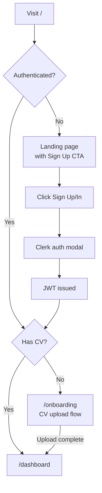
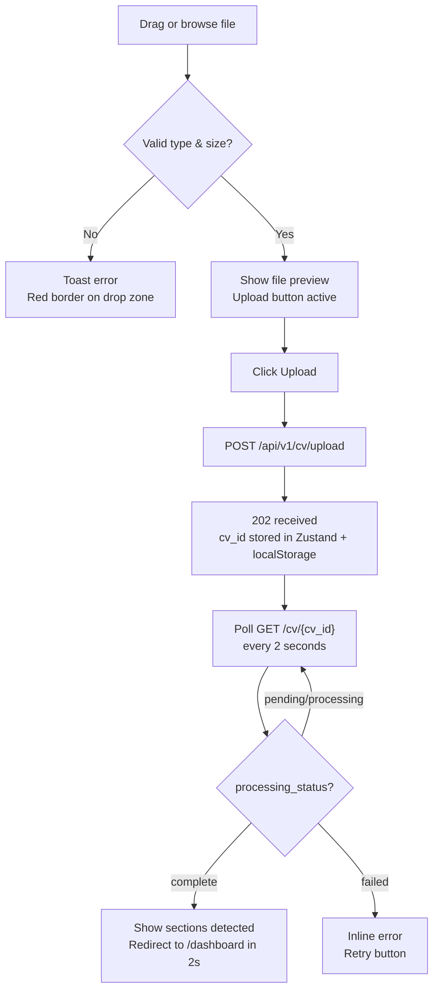
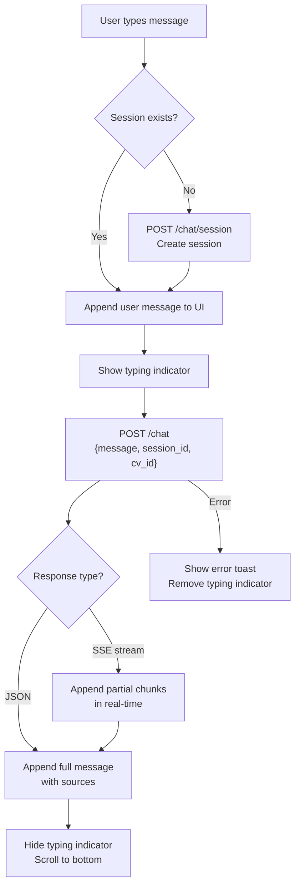
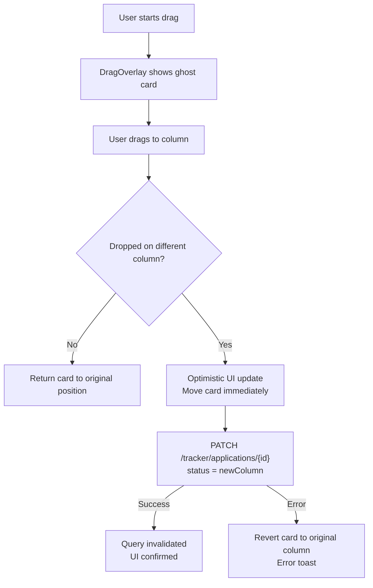

# FILE: frontend-ui-spec.md

**Purpose:** Complete implementation specification for the CareerPilot frontend — all pages, components, state management, data fetching, design system, and testing.

**Scope:** Everything inside `frontend/`. No backend or infrastructure logic.

**Dependencies:** Consumes all API endpoints defined in `backend-ai-spec.md § 3. API Design`. Shared data models from `master-spec.md § 6`. Authentication via Clerk as configured in `integrations-tracker-deployment-spec.md § 1`.

---

## Table of Contents

1. [Frontend Architecture](#1-frontend-architecture)
2. [UI System](#2-ui-system)
3. [Component Architecture](#3-component-architecture)
4. [Page Specifications](#4-page-specifications)
5. [UX Flows](#5-ux-flows)
6. [Frontend Performance](#6-frontend-performance)
7. [Accessibility](#7-accessibility)
8. [Frontend Security](#8-frontend-security)
9. [Frontend Testing](#9-frontend-testing)
10. [Frontend File Structure](#10-frontend-file-structure)
11. [UI Edge Cases](#11-ui-edge-cases)
12. [Design Tradeoffs](#12-design-tradeoffs)

---

## 1. Frontend Architecture

### Next.js App Router Architecture

CareerPilot uses the Next.js 14 App Router. All routes under `(app)/` are protected by Clerk middleware. The root `/` route serves the landing page (public).

```
app/
├── layout.tsx                  ← Root layout: fonts, ClerkProvider, QueryClient, Toaster
├── page.tsx                    ← Landing page (public)
├── (auth)/
│   ├── sign-in/page.tsx        ← Clerk hosted UI
│   └── sign-up/page.tsx        ← Clerk hosted UI
└── (app)/                      ← Protected route group
    ├── layout.tsx              ← App shell: Sidebar + TopBar
    ├── onboarding/page.tsx     ← CV upload (first visit)
    ├── dashboard/page.tsx
    ├── jobs/page.tsx
    ├── chat/page.tsx
    ├── tracker/page.tsx
    ├── calendar/page.tsx
    ├── profile/page.tsx
    └── settings/page.tsx
```

### Rendering Strategy

| Page | Strategy | Reason |
|------|----------|--------|
| Landing (`/`) | Static (SSG) | No user data; maximum cache |
| Dashboard | Client-side (CSR) | Real-time stats; user-specific |
| Jobs search | Client-side (CSR) | Interactive search; dynamic |
| Chat | Client-side (CSR) | Streaming responses; stateful |
| Tracker | Client-side (CSR) | Drag-and-drop; interactive |
| Calendar | Client-side (CSR) | Date interactions |
| Profile | Client-side (CSR) | User-specific CV data |
| Settings | Client-side (CSR) | User-specific |

### State Management

Two state layers:

**Zustand (global persistent state):**
```typescript
// store/useAppStore.ts
interface AppStore {
  // User & CV
  cvId: string | null;
  setCvId: (id: string | null) => void;
  sessionId: string | null;
  setSessionId: (id: string | null) => void;

  // UI state
  sidebarCollapsed: boolean;
  toggleSidebar: () => void;
}

export const useAppStore = create<AppStore>()(
  persist(
    (set) => ({
      cvId: null,
      setCvId: (id) => set({ cvId: id }),
      sessionId: null,
      setSessionId: (id) => set({ sessionId: id }),
      sidebarCollapsed: false,
      toggleSidebar: () => set((s) => ({ sidebarCollapsed: !s.sidebarCollapsed })),
    }),
    { name: "careerpilot-store" }   // persists to localStorage
  )
);
```

**TanStack Query (server state):**
All API data (jobs, applications, todos, stats) is managed by TanStack Query. It handles caching, background refetching, and loading/error states automatically.

```typescript
// Example query
const { data: stats, isLoading, error } = useQuery({
  queryKey: ["dashboard-stats", cvId],
  queryFn: () => api.getDashboardStats(cvId!),
  enabled: !!cvId,
  staleTime: 5 * 60 * 1000,   // 5 minutes
});
```

### Data Fetching Conventions

- Use TanStack Query for ALL server data — never `useState + useEffect + fetch`
- Use `useMutation` for all writes (POST, PATCH, DELETE)
- Always pass `onSuccess` to mutations to invalidate related queries:
  ```typescript
  const mutation = useMutation({
    mutationFn: api.createApplication,
    onSuccess: () => {
      queryClient.invalidateQueries({ queryKey: ["applications"] });
      queryClient.invalidateQueries({ queryKey: ["dashboard-stats"] });
    },
  });
  ```

### Route Protection

Clerk middleware in `middleware.ts` protects all `(app)/` routes:

```typescript
// middleware.ts
import { clerkMiddleware, createRouteMatcher } from "@clerk/nextjs/server";

const isPublicRoute = createRouteMatcher(["/", "/sign-in(.*)", "/sign-up(.*)"]);

export default clerkMiddleware((auth, request) => {
  if (!isPublicRoute(request)) auth().protect();
});
```

---

## 2. UI System

### Design Tokens

```typescript
// tailwind.config.ts — extend with CareerPilot tokens
const config = {
  theme: {
    extend: {
      colors: {
        brand: {
          50:  "#eef2ff",
          500: "#6366f1",   // Indigo — primary actions
          600: "#4f46e5",
          900: "#1e1b4b",
        },
        fit: {
          high:   "#16a34a",  // Green — fit score ≥ 75%
          medium: "#d97706",  // Amber — 50–74%
          low:    "#dc2626",  // Red — < 50%
        },
        status: {
          applied:      "#3b82f6",   // Blue
          interviewing: "#f59e0b",   // Amber
          offer:        "#22c55e",   // Green
          rejected:     "#ef4444",   // Red
        },
      },
      fontFamily: {
        sans: ["Inter", "system-ui", "sans-serif"],
        mono: ["JetBrains Mono", "monospace"],
      },
      borderRadius: {
        card: "12px",
      },
    },
  },
};
```

### Typography Scale

| Token | Size | Weight | Usage |
|-------|------|--------|-------|
| `text-display` | 36px | 700 | Page hero headings |
| `text-heading` | 24px | 600 | Section headings |
| `text-subheading` | 18px | 500 | Card titles |
| `text-body` | 14px | 400 | Body text |
| `text-caption` | 12px | 400 | Labels, timestamps |
| `text-mono` | 13px | 400 | Code, IDs |

### Layout Rules

- App shell: fixed sidebar (240px wide) + top bar (56px) + main content area
- Content max-width: 1200px, centered
- Page padding: `px-6 py-8` on desktop, `px-4 py-6` on mobile
- Card padding: `p-5`
- Grid: 12-column grid; most layouts use 4-col or 3-col sub-grids

### Responsive Breakpoints

| Breakpoint | Min Width | Layout Change |
|-----------|----------|---------------|
| `sm` | 640px | Single column → 2 columns |
| `md` | 768px | Mobile nav → sidebar starts appearing |
| `lg` | 1024px | Full sidebar visible |
| `xl` | 1280px | Max content width reached |

**Mobile (< 768px):** Sidebar collapses to a hamburger. Main content is full-width. Kanban columns scroll horizontally. Calendar shows agenda view instead of monthly grid.

### Dark Mode

Support via Tailwind's `dark:` prefix. System preference auto-detection using `next-themes`. All color tokens have explicit dark equivalents. No hardcoded `#` colors outside of `tailwind.config.ts`.

---

## 3. Component Architecture

### Component Taxonomy

```
components/
├── ui/           ← shadcn/ui primitives (Button, Card, Dialog, etc.)
├── layout/       ← Sidebar, TopBar, AppShell
├── cv/           ← CVUpload, CVSections, SectionCard
├── jobs/         ← SearchBar, JobCard, JobCardGrid, FitScoreBadge
├── chat/         ← ChatWindow, ChatMessage, ChatInput, SuggestedPrompts, SourcePills
├── tracker/      ← KanbanBoard, KanbanColumn, ApplicationCard, AddApplicationModal
├── calendar/     ← CalendarView, TodoList, TodoItem, AddTodoModal, GoalCard
└── dashboard/    ← StatsGrid, StatCard, RecentApplications, AICard, UpcomingDeadlines
```

### Key Component Specs

#### `<FitScoreBadge score={number | null} />`

```typescript
interface FitScoreBadgeProps {
  score: number | null;
  showLabel?: boolean;
}
// Renders: green pill for ≥75, amber for 50–74, red for <50, grey for null
// Example: <FitScoreBadge score={82} /> → "82% Match" in green
```

#### `<JobCard job={Job} onTrack={() => void} />`

Props: full `Job` object + `onTrack` callback.

States:
- Default: shows all fields, "Track this job" button active
- Loading track: button shows spinner
- Tracked: button shows "Added ✓", disabled
- Expanded: shows "Why this score?" section with `fit_reasons` and `gap_reasons` as bullet lists

#### `<ChatMessage message={ChatMessage} />`

```typescript
interface ChatMessageProps {
  message: ChatMessage;
  isStreaming?: boolean;   // Shows cursor animation when true
}
```

- User messages: right-aligned, brand background
- Assistant messages: left-aligned, neutral background, markdown rendered via `react-markdown`
- Sources: below assistant messages, shown as small pill chips (`[Experience]` `[Skills]`)
- Copy button: icon-only, appears on hover, `aria-label="Copy message"`

#### `<KanbanBoard />`

Uses `@dnd-kit/core` with `DndContext` and `SortableContext`. Four droppable columns. Drag overlay shows a ghost card during drag.

```typescript
function KanbanBoard() {
  const { data: applications } = useQuery(["applications"], api.getApplications);
  const mutation = useMutation({ mutationFn: api.updateApplication });
  const sensors = useSensors(useSensor(PointerSensor), useSensor(TouchSensor));

  function handleDragEnd(event: DragEndEvent) {
    const { active, over } = event;
    if (!over || active.id === over.id) return;
    const newStatus = over.id as Application["status"];
    mutation.mutate({ id: active.id as string, status: newStatus });
  }

  return (
    <DndContext sensors={sensors} onDragEnd={handleDragEnd}>
      {COLUMNS.map(col => (
        <KanbanColumn key={col.status} status={col.status} applications={...} />
      ))}
    </DndContext>
  );
}
```

#### `<CalendarView />`

Uses `@fullcalendar/react` with `dayGridPlugin` and `interactionPlugin`.

- Events sourced from: `applications` (deadline dates, color = `status.applied`), `todos` (due dates, color = indigo)
- Clicking a day opens the todo panel filtered to that date
- Clicking an event opens the relevant card (application or todo)
- `dateClick` callback: opens `<AddTodoModal>` with `due_date` pre-filled

#### `<StatsGrid />`

Renders 4 `<StatCard>` components in a 2×2 grid on mobile, 4-column row on desktop.

```typescript
interface StatCardProps {
  label: string;
  value: number | string;
  trend?: { direction: "up" | "down" | "flat"; delta: number };
  icon: LucideIcon;
  color: "brand" | "green" | "amber" | "red";
  suffix?: string;   // e.g. "%" or "days"
}
```

---

## 4. Page Specifications

### Landing Page (`/`)

**Purpose:** Convert visitors to sign-ups. Explain the product value proposition.

**Layout:** Full-width, centered. Hero → Features → CTA.

**Components:**
- Hero: headline "Your AI Career Co-pilot", subheadline, CTA button "Get Started Free" → `/sign-up`
- Features: 4 icon cards (Job Hunter, AI Assistant, Fit Scoring, Tracker)
- Social proof placeholder: "Built for hackathon — expanding soon"

**States:** Single state. No loading. No auth.

---

### Dashboard (`/dashboard`)

**Purpose:** Daily home base. Show progress, recent activity, AI nudge.

**Layout:** 3-row layout:
- Row 1: `<StatsGrid />` — 4 stat cards
- Row 2 (2-col split): Left = `<RecentApplications />` | Right = `<AICard />`
- Row 3: `<UpcomingDeadlines />`

**Loading state:** Skeleton cards in place of each real component while TanStack Query is fetching. Fetch all data in parallel with `Promise.all` pattern.

**Empty state (new user):** Shows an onboarding checklist: "Upload your CV → Search for jobs → Track your first application". Each step links to the relevant page.

**Error state:** "Could not load your dashboard. Retry →" button that calls `queryClient.refetchQueries()`.

---

### Onboarding / CV Upload (`/onboarding`)

**Purpose:** First-time CV upload. Shown on first login before redirecting to dashboard.

**Layout:** Centered card, 600px max-width.

**Steps:**
1. **Upload step:** `<CVUpload />` drag-and-drop zone + "or browse" link. File type validation: `.pdf`, `.docx` only. File size: max 10MB.
2. **Processing step:** Spinner with messages cycling through: "Reading your CV...", "Identifying sections...", "Building your profile..." (polls `GET /api/v1/cv/{cv_id}` every 2 seconds until `processing_status === "complete"`)
3. **Success step:** Green checkmark + list of detected sections. "View your profile" + "Start searching" buttons.

**States:**

| State | UI |
|-------|----|
| Idle | Drag-and-drop zone with upload icon |
| File selected | File name + size shown, "Upload" button active |
| Uploading | Progress indicator, button disabled |
| Processing (polling) | Animated spinner, "Analysing your CV..." |
| Complete | Sections list, two CTA buttons |
| Error (upload) | Red toast + "Try again" button |
| Error (processing failed) | Inline error: "Processing failed. Please re-upload." |

---

### Job Search (`/jobs`)

**Purpose:** Search for jobs and see fit-scored results.

**Layout:** Full-width. Search bar at top. Results grid below.

**Components:**
- `<SearchBar />`: text input (placeholder: "e.g. ML engineer, data scientist") + location input + "Search" button
- Filter chips: `All | High Fit (≥75%) | Applied` — client-side filtering
- `<JobCardGrid />`: responsive 2-column grid on desktop, 1-column on mobile
- Loading: 6 skeleton `<JobCard />` placeholders

**Interactions:**
- Submit: calls `searchJobs(q, location, cvId)` via TanStack Query mutation
- "Track" button: calls `createApplication`, button becomes "Added ✓"
- Expanding "Why this score?": local state toggle, no network call
- Clicking job URL: opens in new tab with `rel="noopener noreferrer"`

**States:**

| State | UI |
|-------|----|
| Initial (no search) | Suggested searches: "ML internships", "software engineer Dhaka" |
| Loading | 6 skeleton cards |
| Results | Grid of `<JobCard />` components |
| Empty results | Illustration + "No jobs found. Try a broader search." |
| Error | "Search failed. Check your connection." + Retry button |
| No CV uploaded | Banner: "Upload your CV to see personalised fit scores →" |

---

### AI Assistant (`/chat`)

**Purpose:** Conversational career guidance grounded in the user's CV.

**Layout:** Full-height split. Left: conversation panel (70%). Right: context panel (30%) on desktop. Mobile: single-column, context panel hidden.

**Left panel — Chat:**
- `<ChatWindow />`: scrollable message list
- `<SuggestedPrompts />`: 4 chips, hidden after first message
- `<ChatInput />`: multiline textarea + send button + character counter (2,000 limit)
- Typing indicator: three animated dots

**Right panel — Context:**
- "Your CV Sections" — collapsible list of sections found in CV
- "Session" — current session ID (for debugging), "New chat" button

**Interactions:**
- Send: calls `POST /api/v1/chat`, appends user message immediately (optimistic), appends assistant message when response arrives
- Streaming: if backend returns `text/event-stream`, append chunks in real-time to the last assistant message
- "New chat": calls `POST /api/v1/chat/session`, clears message list

**States:**

| State | UI |
|-------|----|
| Initial | Suggested prompts visible, empty message list |
| User message sent | Message appears right-aligned, typing indicator |
| Response received | Assistant message appears with source pills |
| Streaming | Assistant message shows partial text with cursor `▌` |
| LLM error | "AI is temporarily unavailable. Try again." toast |
| No CV | Banner: "Upload your CV for grounded answers →" |
| Rate limited | "You've sent 30 messages this hour. Please wait." |

---

### Application Tracker (`/tracker`)

**Purpose:** Kanban board for managing job applications.

**Layout:** Full-width. 4 equal columns. Horizontal scroll on mobile.

**Components:**
- `<KanbanBoard />`: 4 droppable columns
- `<KanbanColumn />`: labelled, colour-coded header, count badge, cards list
- `<ApplicationCard />`: job title, company, date, status badge, notes toggle, delete button
- `<AddApplicationModal />`: dialog with form fields

**Interactions:**
- Drag card → column: `PATCH /api/v1/tracker/applications/{id}` with new `status`
- Edit notes inline: click notes text → textarea → blur to save
- Delete: confirmation dialog → `DELETE /api/v1/tracker/applications/{id}`
- Add: "+ Add Application" button → `<AddApplicationModal />`

---

### Calendar (`/calendar`)

**Purpose:** Deadline and to-do management with a visual calendar.

**Layout:** 2-column. Left: `<CalendarView />` (60%). Right: `<TodoList />` (40%). Mobile: stacked.

**Interactions:**
- Click day on calendar → TodoList filters to that day
- Click event → opens application card or todo edit
- Date click (empty) → opens `<AddTodoModal>` with date pre-filled
- Check todo → marks done, triggers goal progress update

---

### Profile (`/profile`)

**Purpose:** View parsed CV sections and manage CV.

**Layout:** Centered, max 800px. One accordion per section.

**Components:**
- "Re-upload CV" button at top
- `<SectionCard section="experience" content="..." />` × N (shadcn Accordion)
- `cv_id` display at bottom (small, muted)

**States:** Loading skeleton, sections accordion, empty section placeholder ("Not detected in your CV").

---

### Settings (`/settings`)

**Purpose:** User preferences and account management.

**Sections:**
- Account: name, email (read-only from Clerk), "Manage account" → Clerk UserProfile
- Notifications: nudge frequency toggle (daily / every 3 days / weekly / off)
- Data: "Delete all my data" → destructive confirmation dialog

---

## 5. UX Flows

### Authentication Flow



### CV Upload Flow



### AI Interaction Flow



### Kanban Drag Flow



---

## 6. Frontend Performance

### Code Splitting

Next.js App Router provides automatic route-level code splitting. Additionally:

- `@fullcalendar/*` packages are lazy-loaded only on `/calendar`
- `@dnd-kit/*` packages are lazy-loaded only on `/tracker`
- `react-markdown` is lazy-loaded in `<ChatMessage />`

```typescript
// Lazy load heavy components
const CalendarView = dynamic(() => import("@/components/calendar/CalendarView"), {
  loading: () => <Skeleton className="h-96 w-full" />,
  ssr: false,
});
```

### TanStack Query Caching

```typescript
const queryClient = new QueryClient({
  defaultOptions: {
    queries: {
      staleTime: 5 * 60 * 1000,      // Data fresh for 5 minutes
      gcTime: 30 * 60 * 1000,         // Keep in cache for 30 minutes
      retry: 2,
      retryDelay: (attempt) => Math.min(1000 * 2 ** attempt, 10000),
    },
  },
});
```

### Image Optimization

Use `next/image` for all images. Landing page hero image: WebP format, `priority` prop.

### Prefetching

On hover over sidebar nav links, prefetch the route:

```typescript
<Link href="/jobs" prefetch={true}>Jobs</Link>
```

---

## 7. Accessibility

### WCAG 2.1 AA Targets

| Criterion | Implementation |
|-----------|---------------|
| 1.4.3 Contrast | All text meets 4.5:1 ratio against background |
| 2.1.1 Keyboard | All interactive elements reachable via Tab |
| 2.4.3 Focus Order | Logical focus order in all modals and forms |
| 4.1.2 Name, Role, Value | All icon-only buttons have `aria-label` |

### Icon-Only Buttons

All icon-only buttons MUST have `aria-label`:

```tsx
<Button variant="ghost" size="icon" aria-label="Delete application">
  <Trash2 className="h-4 w-4" />
</Button>
```

### Focus Management

When a modal opens, focus moves to the first interactive element inside it. When modal closes, focus returns to the trigger element.

```typescript
// shadcn Dialog handles this automatically via Radix UI
```

### Keyboard Navigation

| Component | Keyboard Support |
|-----------|-----------------|
| Kanban board | Tab to cards, Enter to expand, Delete key to delete |
| Chat input | Enter to send, Shift+Enter for newline |
| Calendar | Arrow keys to navigate days |
| Sidebar | Tab + Enter to navigate links |

### Screen Reader

- All form inputs have associated `<label>` elements
- Loading states use `aria-busy="true"` and `aria-label="Loading..."`
- Dynamic content updates announced via `aria-live="polite"` region

---

## 8. Frontend Security

### XSS Prevention

- All user-generated content rendered via `react-markdown` with `rehype-sanitize` plugin — strips all HTML tags not in the allowlist
- Never use `dangerouslySetInnerHTML` with user content
- CV content rendered as pre-formatted text (`<pre>` tag), never injected as HTML

### Secure Storage

- `cvId` and `sessionId` stored in `localStorage` via Zustand persist — acceptable for non-sensitive IDs
- JWT is managed entirely by Clerk SDK — never stored or accessed manually
- No API keys, secrets, or sensitive tokens stored in frontend code or localStorage

### Content Security Policy

```typescript
// next.config.js
const securityHeaders = [
  { key: "X-Content-Type-Options", value: "nosniff" },
  { key: "X-Frame-Options", value: "DENY" },
  { key: "Referrer-Policy", value: "strict-origin-when-cross-origin" },
  {
    key: "Content-Security-Policy",
    value: [
      "default-src 'self'",
      "script-src 'self' 'unsafe-inline' https://clerk.careerpilot.app",
      "style-src 'self' 'unsafe-inline'",
      "img-src 'self' data: https:",
      "connect-src 'self' https://api.careerpilot.app https://clerk.careerpilot.app",
      "frame-src https://clerk.careerpilot.app",
    ].join("; ")
  }
];
```

### Input Validation

All user inputs validated client-side before submission:
- Chat messages: max 2,000 characters, shown via character counter
- File uploads: extension whitelist (`.pdf`, `.docx`) + MIME type check
- Form fields: minimum required lengths, no script injection patterns

---

## 9. Frontend Testing

### Unit Tests (Vitest)

```typescript
// tests/unit/fitScoreBadge.test.tsx
import { render, screen } from "@testing-library/react";
import { FitScoreBadge } from "@/components/jobs/FitScoreBadge";

test("renders green badge for score ≥ 75", () => {
  render(<FitScoreBadge score={82} />);
  const badge = screen.getByText("82% Match");
  expect(badge).toHaveClass("text-fit-high");
});

test("renders amber badge for score 50–74", () => {
  render(<FitScoreBadge score={60} />);
  expect(screen.getByText("60% Match")).toHaveClass("text-fit-medium");
});

test("renders grey for null score", () => {
  render(<FitScoreBadge score={null} />);
  expect(screen.getByText("N/A")).toBeInTheDocument();
});
```

### Component Tests (React Testing Library)

```typescript
// tests/components/JobCard.test.tsx
test("Track button becomes disabled after click", async () => {
  const onTrack = vi.fn().mockResolvedValue(undefined);
  render(<JobCard job={mockJob} onTrack={onTrack} />);

  const button = screen.getByRole("button", { name: /track this job/i });
  await userEvent.click(button);

  expect(onTrack).toHaveBeenCalledOnce();
  expect(button).toBeDisabled();
  expect(screen.getByText("Added ✓")).toBeInTheDocument();
});
```

### E2E Tests (Playwright)

```typescript
// tests/e2e/onboarding.spec.ts
test("CV upload flow completes successfully", async ({ page }) => {
  await page.goto("/onboarding");
  const fileInput = page.locator('input[type="file"]');
  await fileInput.setInputFiles("tests/fixtures/sample_cv.pdf");
  await page.getByRole("button", { name: /upload/i }).click();
  await expect(page.getByText("Experience")).toBeVisible({ timeout: 30000 });
  await expect(page.getByText("Skills")).toBeVisible();
  await expect(page).toHaveURL(/dashboard/);
});
```

### Visual Regression Tests (Chromatic or Percy)

- Snapshot baseline for: `<JobCard />`, `<FitScoreBadge />`, `<StatCard />`, `<KanbanColumn />`
- Run on every PR to catch unintended visual changes

---

## 10. Frontend File Structure

```
frontend/
├── package.json
├── tsconfig.json
├── next.config.js                  # CSP headers, image domains
├── tailwind.config.ts              # Design tokens, extensions
├── components.json                 # shadcn/ui config
├── .env.local.example
├── vitest.config.ts
├── playwright.config.ts
│
├── src/
│   ├── app/
│   │   ├── layout.tsx              # Root: ClerkProvider, QueryClientProvider, Toaster
│   │   ├── page.tsx                # Landing page
│   │   ├── (auth)/
│   │   │   ├── sign-in/page.tsx
│   │   │   └── sign-up/page.tsx
│   │   └── (app)/
│   │       ├── layout.tsx          # App shell (Sidebar + TopBar)
│   │       ├── onboarding/page.tsx
│   │       ├── dashboard/page.tsx
│   │       ├── jobs/page.tsx
│   │       ├── chat/page.tsx
│   │       ├── tracker/page.tsx
│   │       ├── calendar/page.tsx
│   │       ├── profile/page.tsx
│   │       └── settings/page.tsx
│   │
│   ├── components/
│   │   ├── ui/                     # shadcn/ui: Button, Card, Dialog, Input...
│   │   ├── layout/
│   │   │   ├── Sidebar.tsx
│   │   │   ├── TopBar.tsx
│   │   │   └── AppShell.tsx
│   │   ├── cv/
│   │   │   ├── CVUpload.tsx        # Drag-and-drop upload zone
│   │   │   └── SectionCard.tsx     # Displays one CV section
│   │   ├── jobs/
│   │   │   ├── SearchBar.tsx
│   │   │   ├── JobCard.tsx
│   │   │   ├── JobCardGrid.tsx
│   │   │   └── FitScoreBadge.tsx
│   │   ├── chat/
│   │   │   ├── ChatWindow.tsx
│   │   │   ├── ChatMessage.tsx     # Supports markdown + source pills
│   │   │   ├── ChatInput.tsx
│   │   │   ├── SuggestedPrompts.tsx
│   │   │   ├── SourcePill.tsx
│   │   │   └── TypingIndicator.tsx
│   │   ├── tracker/
│   │   │   ├── KanbanBoard.tsx
│   │   │   ├── KanbanColumn.tsx
│   │   │   ├── ApplicationCard.tsx
│   │   │   └── AddApplicationModal.tsx
│   │   ├── calendar/
│   │   │   ├── CalendarView.tsx
│   │   │   ├── TodoList.tsx
│   │   │   ├── TodoItem.tsx
│   │   │   ├── AddTodoModal.tsx
│   │   │   └── GoalCard.tsx
│   │   └── dashboard/
│   │       ├── StatsGrid.tsx
│   │       ├── StatCard.tsx
│   │       ├── RecentApplications.tsx
│   │       ├── AICard.tsx          # Nudge display
│   │       └── UpcomingDeadlines.tsx
│   │
│   ├── lib/
│   │   ├── api.ts                  # All typed API call functions
│   │   └── utils.ts                # cn(), formatDate(), etc.
│   │
│   ├── store/
│   │   └── useAppStore.ts          # Zustand store
│   │
│   ├── types/
│   │   └── index.ts                # All TypeScript interfaces (mirrors master-spec models)
│   │
│   └── hooks/
│       ├── useCV.ts                # useQuery wrapper for CV data
│       ├── useSession.ts           # Session management
│       └── useApplications.ts     # Applications CRUD hooks
│
└── tests/
    ├── fixtures/
    │   └── sample_cv.pdf
    ├── unit/
    │   ├── FitScoreBadge.test.tsx
    │   └── StatCard.test.tsx
    ├── components/
    │   ├── JobCard.test.tsx
    │   └── ChatMessage.test.tsx
    └── e2e/
        ├── onboarding.spec.ts
        ├── job-search.spec.ts
        └── chat.spec.ts
```

---

## 11. UI Edge Cases

| Scenario | Handling |
|----------|---------|
| AI response takes > 8 seconds | Show "Still thinking..." message after 5 seconds; "This is taking longer than usual" after 10 seconds |
| Job search returns 0 results | Empty state illustration + 3 suggested searches |
| CV upload fails (network error) | Retry button; file NOT cleared from drop zone so user doesn't have to re-select |
| CV processing stuck in `pending` for > 60 seconds | Show warning: "Processing is taking longer than expected." + "Retry processing" button |
| Session JWT expires mid-session | Clerk handles refresh automatically; if refresh fails, redirect to `/sign-in` with `toast.error("Session expired. Please sign in again.")` |
| User uploads second CV before first is processed | Show: "A CV is already processing. Please wait." and block new upload |
| Kanban drag to same column | No-op; no API call made |
| Chat message sent with no CV | Show inline warning in chat: "Your responses will be generic without a CV. Upload your CV for personalized answers." |
| Offline state | `navigator.onLine` check before API calls; show persistent banner "You're offline. Some features may not work." |
| Mobile touch drag on Kanban | `TouchSensor` from dnd-kit handles this; columns scroll horizontally via CSS overflow-x-auto |
| Empty dashboard (new user) | Onboarding checklist shown instead of blank stat cards |
| `fit_score` is null (no CV provided) | Show "—" with tooltip "Upload your CV to see your fit score" |
| Very long CV content in sections | Truncate to 500 characters with "Show more" toggle |

---

## 12. Design Tradeoffs

### SSR vs CSR

All authenticated pages use CSR (client-side rendering). The alternative (SSR with cookie-based auth) would require Clerk server-side token validation on every page render, adding latency on Railway. Since all page data is user-specific and not indexable, there is no SEO benefit to SSR. CSR also simplifies the AI streaming implementation (cannot stream into an SSR page without complex hydration logic).

**Tradeoff:** Initial page load shows a loading skeleton (FOUC on some pages). Acceptable for a productivity tool used by returning users.

### Streaming Complexity

Streaming AI responses (`text/event-stream`) significantly improves perceived performance but adds implementation complexity: the frontend must handle partial SSE chunks, reconnect on disconnect, and merge chunks into a single message. For the MVP, streaming is implemented as a progressive enhancement — the chat UI works with standard JSON responses and streaming is added on top.

**Tradeoff:** If streaming is not implemented before the deadline, fallback to JSON polling (poll every 500ms for response completion) rather than blocking the chat feature.

### Real-time Sync Tradeoffs

The Kanban board and dashboard use TanStack Query polling (every 30 seconds) rather than WebSockets. This is sufficient for the MVP since CareerPilot is a single-user tool (no real-time collaboration). WebSockets would add infrastructure complexity (sticky sessions on Railway) for no user-visible benefit.

**Tradeoff:** Two browser tabs open simultaneously will diverge for up to 30 seconds. Acceptable for MVP.

---

*This spec is authoritative for all frontend decisions. Cross-reference `backend-ai-spec.md § 3. API Design` for endpoint contracts and `master-spec.md § 6` for shared data models.*
