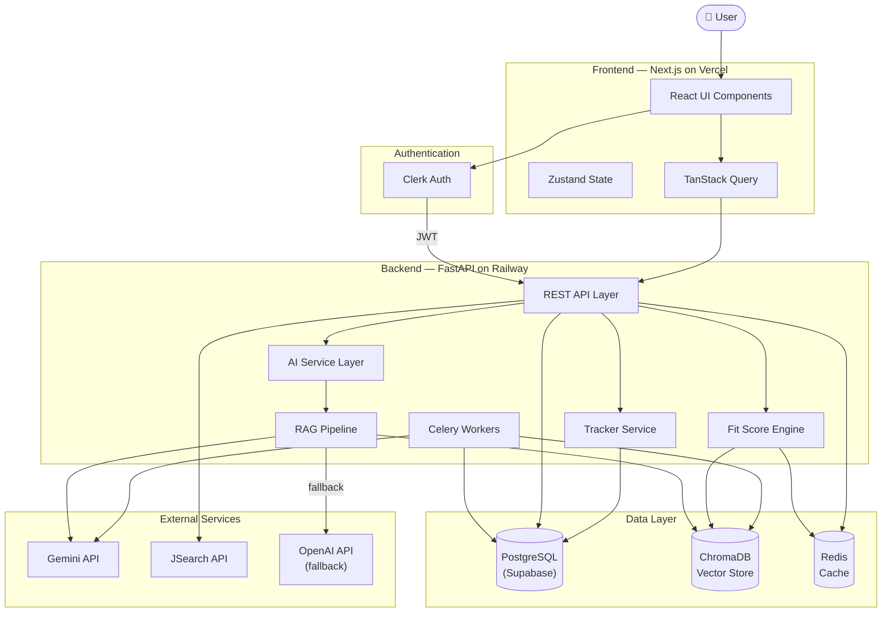
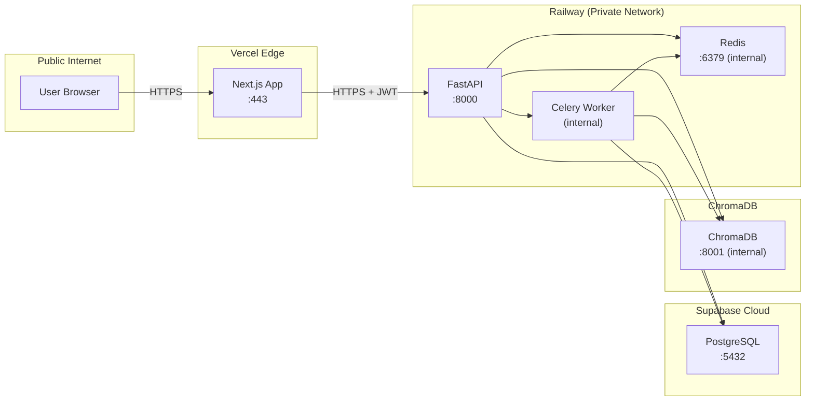
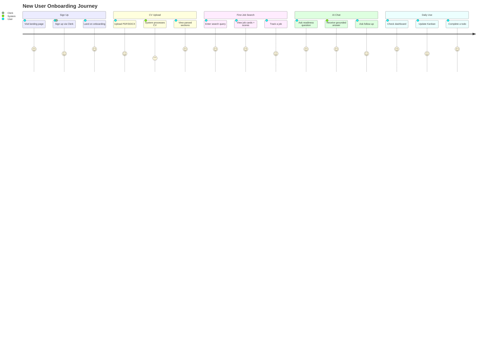
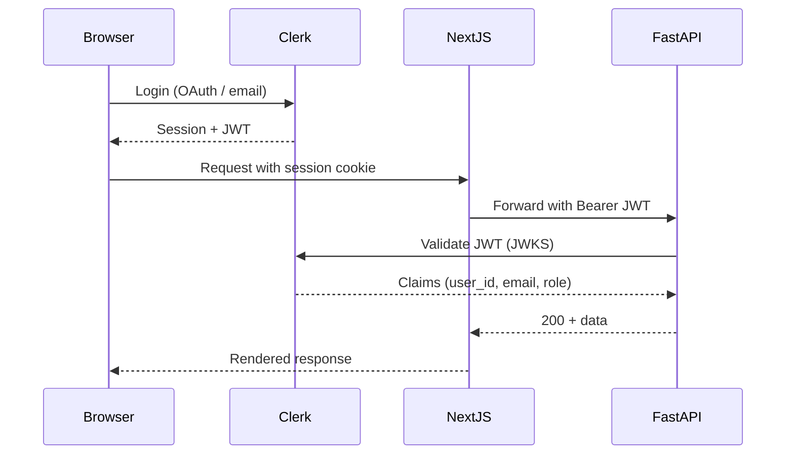

# FILE: master-spec.md

**Purpose:** Global architecture and product blueprint for CareerPilot. This is the single source of truth for system-wide decisions, shared data models, security posture, engineering standards, and cross-team alignment.

**Scope:** Covers the entire CareerPilot platform — all four pillars, all services, all environments.

**Dependencies:** This file is the root document. All other spec files (`backend-ai-spec.md`, `frontend-ui-spec.md`, `integrations-tracker-deployment-spec.md`) depend on and must remain consistent with this file.

---

## Table of Contents

1. [Executive Summary](#1-executive-summary)
2. [Project Scope](#2-project-scope)
3. [High-Level Architecture](#3-high-level-architecture)
4. [Product Requirements](#4-product-requirements)
5. [System-Wide Non-Functional Requirements](#5-system-wide-non-functional-requirements)
6. [Shared Data Models](#6-shared-data-models)
7. [Global Security Architecture](#7-global-security-architecture)
8. [Engineering Standards](#8-engineering-standards)
9. [Repository Structure](#9-repository-structure)
10. [Environment Strategy](#10-environment-strategy)
11. [Development Roadmap](#11-development-roadmap)
12. [Risks & Tradeoffs](#12-risks--tradeoffs)
13. [Open Questions](#13-open-questions)
14. [Cross-Reference Map](#14-cross-reference-map)

---

## 1. Executive Summary

### Vision

CareerPilot is an AI-first career operating system that actively works for job seekers — hunting jobs, scoring fit, drafting applications, identifying skill gaps, and holding users accountable — all grounded in the user's own CV as the single source of truth.

### Purpose

Today's job seekers face a fragmented, reactive experience: scattered job boards, generic AI tools with no memory of who they are, zero visibility into skill gaps, and no accountability infrastructure. CareerPilot collapses this into a single daily-use platform.

### Product Goals

| Goal | Success Metric |
|------|---------------|
| Eliminate CV hallucination | 100% of AI responses cite retrieved CV chunks |
| Active job hunting | Live job search with programmatic fit scores in < 5s |
| Personalized career guidance | All 4 benchmark query types supported |
| Daily-use accountability | Streak counter, nudges, Kanban board, calendar |
| Hackathon viability | Full MVP runnable locally within 30 minutes of clone |

### Target Audience

**Primary:** University students, intern seekers, entry-level candidates, software engineering and ML/AI candidates, career switchers.

**Secondary (future):** Recruiters, career mentors, educational institutions.

---

## 2. Project Scope

### In-Scope Features (MVP)

- PDF and DOCX CV upload with semantic chunking and embedding
- RAG pipeline over uploaded CV (ChromaDB vector store)
- Job Hunter Agent with live job search (JSearch API)
- Programmatic fit score computation (cosine similarity, not LLM-generated)
- AI Assistant supporting: job readiness analysis, skill gap analysis, learning roadmap generation, cover letter drafting
- Conversational memory within a session
- Kanban application tracker (Applied / Interviewing / Offer / Rejected)
- Calendar and to-do module linked to career goals
- Progress dashboard with streak counter and weekly stats
- Proactive AI nudges for inactivity detection
- Clerk-based authentication
- Deployment on Vercel (frontend) and Railway (backend)

### Out-of-Scope (Explicitly Excluded from MVP)

- Native mobile applications
- Recruiter portal
- AI mock interview agent
- Multi-user collaboration
- AI resume optimizer (structured rewriting)
- Fine-tuned ranking models
- Calendar provider integrations (Google Calendar, Outlook)
- Email provider integrations (beyond transactional notifications)
- Payment processing
- Multi-language support

### Constraints

- Must be buildable by a 3-person team in 14 days
- Must not hallucinate user background under any circumstances
- Must use RAG grounded in the uploaded CV for all AI outputs
- Fit scores must be computed programmatically, not stated by the LLM
- Must support live job search (at least one live API call per search)
- Must demonstrate conversational memory within a session

### Assumptions

- Users have a CV in PDF or DOCX format
- Users have a stable internet connection
- The Gemini API and JSearch API remain available during the hackathon
- ChromaDB can be run in-process or as a lightweight container
- One Supabase project is sufficient for the MVP database
- A single Railway service is sufficient for the FastAPI backend

---

## 3. High-Level Architecture

### System Overview

CareerPilot is a monorepo consisting of a Next.js frontend, a FastAPI backend, and three data stores: PostgreSQL (Supabase), a Redis cache, and ChromaDB (vector store). External services include Gemini API (LLM), JSearch API (job search), and Clerk (authentication).

### Core Services

| Service | Technology | Responsibility |
|---------|-----------|----------------|
| Frontend | Next.js 14 (App Router) | All UI, state, routing |
| Backend API | FastAPI (Python) | REST API, business logic |
| AI Layer | LangChain + Gemini | RAG, agents, prompts |
| Vector Store | ChromaDB | CV chunk embeddings |
| Relational DB | PostgreSQL (Supabase) | All structured data |
| Cache | Redis | Session memory, fit score cache, job cache |
| Background Workers | Celery | CV processing, AI nudges, analytics |
| Auth | Clerk | Identity, JWT issuance |

### Data Flow Diagram



### Service Boundaries



---

## 4. Product Requirements

### Functional Requirements

#### Pillar 1 — Job Hunter Agent

| ID | Requirement |
|----|-------------|
| FR-JH-01 | User can submit a natural language query to search for jobs |
| FR-JH-02 | System calls a live job board API (JSearch) and returns structured results |
| FR-JH-03 | Each job card displays: title, company, salary range, deadline, location, fit score |
| FR-JH-04 | Fit score is a programmatic percentage (0–100) computed via cosine similarity |
| FR-JH-05 | Each job card includes fit reasons and gap reasons derived from CV |
| FR-JH-06 | User can add any job to their Kanban tracker in one click |
| FR-JH-07 | Results are sorted by fit score descending |

#### Pillar 2 — Profile & Resume Intelligence (RAG Core)

| ID | Requirement |
|----|-------------|
| FR-RAG-01 | User can upload CV in PDF or DOCX format |
| FR-RAG-02 | System chunks CV by section: Experience, Education, Skills, Projects |
| FR-RAG-03 | Each chunk is embedded and stored in ChromaDB |
| FR-RAG-04 | All downstream AI features retrieve context from ChromaDB, never from LLM memory |
| FR-RAG-05 | User can view their parsed CV sections in a profile page |
| FR-RAG-06 | Re-uploading a CV replaces the previous embeddings for that user |

#### Pillar 3 — Personal AI Assistant

| ID | Requirement |
|----|-------------|
| FR-AI-01 | User can ask career questions in a conversational chat interface |
| FR-AI-02 | Assistant supports job readiness analysis ("Am I ready for X role?") |
| FR-AI-03 | Assistant supports skill gap analysis ("What am I missing for X?") |
| FR-AI-04 | Assistant supports learning roadmap generation (week-by-week plan) |
| FR-AI-05 | Assistant supports cover letter drafting grounded in CV |
| FR-AI-06 | Assistant maintains conversational memory within a session (last 10 turns) |
| FR-AI-07 | Every response includes a "sources" list of CV sections used |

#### Pillar 4 — Productivity & Progress Tracker

| ID | Requirement |
|----|-------------|
| FR-TR-01 | User can manage a Kanban board with columns: Applied, Interviewing, Offer, Rejected |
| FR-TR-02 | Cards can be dragged between columns; status persists to database |
| FR-TR-03 | User can create, complete, and delete to-do items linked to goals |
| FR-TR-04 | Calendar view shows deadlines and to-do due dates |
| FR-TR-05 | Dashboard shows: applications this week, skills count, roadmap progress %, streak |
| FR-TR-06 | System detects 3-day inactivity and sends an AI nudge with matching jobs |
| FR-TR-07 | Goals have a progress bar auto-updated as linked todos are completed |

### User Journeys



### User Roles

| Role | Description | Access |
|------|-------------|--------|
| `user` | Standard authenticated job seeker | Full access to own data |
| `admin` | Platform administrator | Read access to all users, manage system config |
| `anonymous` | Unauthenticated visitor | Landing page only |

### Permission Model

| Resource | Anonymous | User (own) | User (others) | Admin |
|----------|-----------|------------|---------------|-------|
| CV | None | CRUD | None | Read |
| Applications | None | CRUD | None | Read |
| Chat sessions | None | CRUD | None | None |
| Dashboard stats | None | Read | None | Read |
| Goals / Todos | None | CRUD | None | Read |

---

## 5. System-Wide Non-Functional Requirements

### Scalability

| Metric | MVP Target | Future Target (10k users) |
|--------|-----------|--------------------------|
| Concurrent users | 50 | 10,000 |
| CV uploads/day | 100 | 5,000 |
| Job searches/day | 500 | 50,000 |
| AI chat messages/day | 1,000 | 200,000 |
| ChromaDB vectors | 10,000 | 5,000,000 |

Scaling strategy: FastAPI scales horizontally behind a Railway load balancer. ChromaDB migrates to a managed vector DB (Pinecone or Weaviate) at scale. Redis is used to cache fit scores and job results to reduce API calls. Celery workers scale independently from the API.

### Reliability

- CV processing pipeline includes retry logic (3 attempts with exponential backoff)
- All LLM calls include a fallback: Gemini → OpenAI
- Dead-letter queue for failed Celery jobs
- Database connection pooling via SQLAlchemy (pool size: 10, max overflow: 20)

### Availability

- MVP SLO: 95% uptime (acceptable for hackathon)
- Production SLO: 99.5% uptime
- Health check endpoints: `GET /health` on backend, Vercel deployment health

### Security

See [Section 7 — Global Security Architecture](#7-global-security-architecture).

### Maintainability

- Monorepo with clear domain boundaries
- Type-safe API layer (Pydantic on backend, TypeScript on frontend)
- All AI prompts stored as versioned strings in `backend/prompts/`
- No hardcoded secrets anywhere in source code

### Observability

- Structured JSON logging on all backend services
- Request ID propagated through all service calls
- AI telemetry: log prompt, model, token count, latency for every LLM call
- Frontend: error boundary reporting to console (Sentry in production)

---

## 6. Shared Data Models

These are the canonical entity definitions. Backend Pydantic schemas and frontend TypeScript interfaces must match these exactly.

### User

```typescript
interface User {
  id: string;               // UUID, from Clerk
  email: string;
  full_name: string;
  clerk_id: string;         // Clerk user ID
  created_at: string;       // ISO 8601
  updated_at: string;
}
```

### CV

```typescript
interface CV {
  id: string;               // UUID
  user_id: string;
  file_name: string;
  file_type: "pdf" | "docx";
  sections_found: string[]; // ["experience", "education", "skills", "projects"]
  processing_status: "pending" | "processing" | "complete" | "failed";
  created_at: string;
  updated_at: string;
}
```

### CVChunk

```typescript
interface CVChunk {
  id: string;               // UUID
  cv_id: string;
  section: "experience" | "education" | "skills" | "projects" | "summary" | "other";
  content: string;          // Raw text of the chunk
  chroma_vector_id: string; // ID in ChromaDB
  created_at: string;
}
```

### Job

```typescript
interface Job {
  id: string;               // JSearch job ID
  title: string;
  company: string;
  location: string;
  salary_min: number | null;
  salary_max: number | null;
  currency: string | null;
  deadline: string | null;  // ISO 8601 date
  description: string;
  url: string;
  source: string;           // "jsearch" | "adzuna" | "manual"
  fit_score: number | null; // 0–100, null if cv_id not provided
  fit_reasons: string[];
  gap_reasons: string[];
  fetched_at: string;
}
```

### Application

```typescript
interface Application {
  id: string;               // UUID
  user_id: string;
  job_title: string;
  company: string;
  location: string | null;
  deadline: string | null;  // ISO date YYYY-MM-DD
  status: "applied" | "interviewing" | "offer" | "rejected";
  notes: string | null;
  job_id: string | null;    // JSearch ID if sourced from search
  fit_score: number | null;
  applied_at: string;
  updated_at: string;
}
```

### ChatSession

```typescript
interface ChatSession {
  id: string;               // UUID
  user_id: string;
  cv_id: string;
  created_at: string;
  last_active_at: string;
}
```

### ChatMessage

```typescript
interface ChatMessage {
  id: string;               // UUID
  session_id: string;
  role: "user" | "assistant";
  content: string;
  sources: string[];        // CV section names used (assistant messages only)
  query_type: "readiness" | "gap" | "roadmap" | "cover_letter" | "general" | null;
  created_at: string;
}
```

### Goal

```typescript
interface Goal {
  id: string;               // UUID
  user_id: string;
  title: string;
  target_date: string | null; // ISO date YYYY-MM-DD
  progress: number;           // 0–100
  created_at: string;
}
```

### Todo

```typescript
interface Todo {
  id: string;               // UUID
  user_id: string;
  goal_id: string | null;
  title: string;
  due_date: string | null;  // ISO date YYYY-MM-DD
  done: boolean;
  created_at: string;
}
```

### DashboardStats

```typescript
interface DashboardStats {
  applications_this_week: number;
  applications_last_week: number;
  skills_count: number;
  roadmap_progress: number;   // 0–100
  streak_days: number;
  total_applications: number;
}
```

### ActivityLog

```typescript
interface ActivityLog {
  id: string;               // UUID
  user_id: string;
  action: ActivityAction;
  metadata: Record<string, unknown>;
  created_at: string;
}

type ActivityAction =
  | "cv_uploaded"
  | "job_searched"
  | "application_created"
  | "application_updated"
  | "application_deleted"
  | "chat_message_sent"
  | "todo_completed"
  | "goal_created";
```

---

## 7. Global Security Architecture

### Authentication

All routes except `GET /health` and `GET /` require a valid Clerk JWT. The backend validates the JWT on every request using Clerk's JWKS endpoint.



### Authorization

- All database queries are scoped by `user_id` extracted from the validated JWT
- No user can access another user's CV, applications, chat history, or goals
- Admin role checked via Clerk `publicMetadata.role` claim

### Secrets Handling

| Secret | Storage | Rotation |
|--------|---------|----------|
| `GEMINI_API_KEY` | Railway env vars | Manual, quarterly |
| `OPENAI_API_KEY` | Railway env vars | Manual, quarterly |
| `CLERK_SECRET_KEY` | Railway env vars | Via Clerk dashboard |
| `DATABASE_URL` | Railway env vars | On Supabase rotation |
| `REDIS_URL` | Railway env vars | On Redis rotation |
| `JSEARCH_API_KEY` | Railway env vars | Manual, quarterly |

No secrets are committed to the repository. `.env` files are in `.gitignore`. `.env.example` contains only variable names, no values.

### Encryption

- All transport is over TLS 1.2+ (enforced by Vercel and Railway)
- CV files are stored temporarily in memory during processing; raw files are not persisted to disk in production
- PostgreSQL connections use TLS (Supabase enforces this)
- Redis connections use TLS in production

### Threat Model

| Threat | Mitigation |
|--------|-----------|
| Prompt injection via CV content | Sanitize CV text before embedding; system prompt includes injection guard |
| Prompt injection via user messages | Input length limit (2,000 chars); injection detection heuristics |
| CV data leakage across users | All ChromaDB queries filtered by `user_id` metadata |
| JWT forgery | JWKS validation on every request; short JWT expiry (1 hour) |
| Excessive LLM spend | Per-user token budget (10,000 tokens/day); rate limiting on chat endpoint |
| SSRF via job URLs | Job URLs validated against allowlist of known job board domains |
| XSS | CSP headers; no `dangerouslySetInnerHTML` with user content |

---

## 8. Engineering Standards

### Coding Standards

**Python (backend):**
- Python 3.11+
- `ruff` for linting and formatting
- `mypy` for type checking (strict mode)
- Pydantic v2 for all data models
- All functions have type annotations
- Docstrings on all public functions (Google style)

**TypeScript (frontend):**
- TypeScript strict mode (`"strict": true`)
- ESLint with `@typescript-eslint` plugin
- Prettier for formatting (2-space indent)
- No `any` types (use `unknown` with type guards)
- All components have explicit prop types

### Documentation Standards

- Every public API endpoint documented with purpose, request schema, response schema, and example
- Every AI prompt stored in `backend/prompts/` with a comment explaining its purpose and version
- Every database table has a comment explaining its purpose
- `README.md` at repo root covers: setup, environment variables, running locally, running tests

### Branching Strategy

```
main              ← production-ready, protected
├── dev           ← integration branch
│   ├── feature/backend-rag          ← Member A
│   ├── feature/frontend-ui          ← Member B
│   └── feature/integrations-tracker ← Member C
```

Rules:
- No direct pushes to `main` or `dev`
- PRs require at least one review before merge to `dev`
- Merge to `main` only after full integration test on `dev`

### Commit Conventions

Format: `type(scope): description`

| Type | Usage |
|------|-------|
| `feat` | New feature |
| `fix` | Bug fix |
| `chore` | Build, config, deps |
| `docs` | Documentation only |
| `test` | Test additions/changes |
| `refactor` | Code restructure, no behaviour change |
| `perf` | Performance improvement |

Examples:
```
feat(rag): add section chunking by regex header detection
fix(tracker): correct goal progress recalculation on todo delete
chore(deps): pin openai to 1.30.0
```

---

## 9. Repository Structure

```
careerpilot/                          ← monorepo root
├── .github/
│   └── workflows/
│       ├── ci.yml                    ← test + lint on every push
│       └── deploy.yml                ← deploy on merge to main
├── backend/                          ← FastAPI application (Member A + C)
│   ├── main.py
│   ├── requirements.txt
│   ├── Dockerfile
│   ├── Procfile
│   ├── .env.example
│   ├── routers/
│   │   ├── cv.py
│   │   ├── chat.py
│   │   ├── jobs.py
│   │   └── tracker.py
│   ├── services/
│   │   ├── rag.py
│   │   ├── embeddings.py
│   │   ├── fit_score.py
│   │   ├── cover_letter.py
│   │   ├── roadmap.py
│   │   └── nudge.py
│   ├── workers/
│   │   ├── celery_app.py
│   │   ├── cv_worker.py
│   │   └── nudge_worker.py
│   ├── models/
│   │   └── schemas.py
│   ├── prompts/
│   │   ├── readiness.py
│   │   ├── gap_analysis.py
│   │   ├── roadmap.py
│   │   └── cover_letter.py
│   ├── db/
│   │   ├── supabase_client.py
│   │   └── chroma_client.py
│   └── tests/
│       ├── test_cv.py
│       ├── test_rag.py
│       ├── test_chat.py
│       ├── test_fit_score.py
│       └── test_tracker.py
├── frontend/                         ← Next.js application (Member B)
│   ├── package.json
│   ├── tsconfig.json
│   ├── next.config.js
│   ├── .env.local.example
│   ├── src/
│   │   ├── app/                      ← App Router pages
│   │   │   ├── layout.tsx
│   │   │   ├── page.tsx              ← Landing / onboarding
│   │   │   ├── dashboard/
│   │   │   ├── jobs/
│   │   │   ├── chat/
│   │   │   ├── tracker/
│   │   │   ├── calendar/
│   │   │   ├── profile/
│   │   │   └── settings/
│   │   ├── components/
│   │   │   ├── ui/                   ← shadcn/ui components
│   │   │   ├── cv/
│   │   │   ├── jobs/
│   │   │   ├── chat/
│   │   │   ├── tracker/
│   │   │   ├── calendar/
│   │   │   └── dashboard/
│   │   ├── lib/
│   │   │   ├── api.ts
│   │   │   └── utils.ts
│   │   ├── store/
│   │   │   └── useAppStore.ts
│   │   └── types/
│   │       └── index.ts
│   └── tests/
│       ├── unit/
│       ├── components/
│       └── e2e/
├── integrations/                     ← External API wrappers (Member C)
│   ├── job_hunter.py
│   ├── fit_score.py
│   └── requirements.txt
├── infra/                            ← Infrastructure config (Member C)
│   ├── docker-compose.yml
│   └── railway.toml
├── docs/
│   ├── architecture.png
│   ├── SYSTEM_DESIGN.md
│   └── EVAL.md
├── api-contracts.md                  ← Sacred shared document
├── SYSTEM_DESIGN.md
├── README.md
└── .env.example
```

---

## 10. Environment Strategy

### Local Development

```bash
# Backend
cd backend
python -m venv venv && source venv/bin/activate
pip install -r requirements.txt
cp .env.example .env   # fill in real keys
uvicorn main:app --reload --port 8000

# ChromaDB (via Docker)
docker run -p 8001:8000 chromadb/chroma

# Redis (via Docker)
docker run -p 6379:6379 redis:alpine

# Frontend
cd frontend
npm install
cp .env.local.example .env.local   # fill NEXT_PUBLIC_API_URL=http://localhost:8000
npm run dev
```

### Environment Variables

| Variable | Dev | Staging | Prod | Owner |
|----------|-----|---------|------|-------|
| `GEMINI_API_KEY` | Real key | Real key | Real key | Member A |
| `OPENAI_API_KEY` | Real key | Real key | Real key | Member A |
| `DATABASE_URL` | Supabase dev | Supabase staging | Supabase prod | Member C |
| `REDIS_URL` | localhost:6379 | Railway Redis | Railway Redis | Member C |
| `CHROMA_HOST` | localhost | Railway | Railway | Member C |
| `CLERK_SECRET_KEY` | Dev app key | Staging app key | Prod app key | Member C |
| `JSEARCH_API_KEY` | Real key | Real key | Real key | Member C |
| `NEXT_PUBLIC_API_URL` | http://localhost:8000 | https://staging.railway.app | https://api.careerpilot.app | Member B |
| `NEXT_PUBLIC_CLERK_PUBLISHABLE_KEY` | Dev key | Staging key | Prod key | Member B |

### Staging vs Production

Staging uses the same infrastructure stack but separate Supabase project, separate Clerk application, and a `dev` Railway environment. Staging is deployed automatically on merge to `dev`. Production is deployed manually after verification.

---

## 11. Development Roadmap

### MVP (Days 1–10) — Hackathon Submission

| Milestone | Owner | Target Day |
|-----------|-------|-----------|
| Repo scaffold + CI | All | Day 1 |
| DB schema + external service accounts | C | Day 1 |
| CV ingestion pipeline | A | Day 3 |
| RAG chain functional | A | Day 4 |
| AI assistant all 4 query types | A | Day 5 |
| Job Hunter live API | C | Day 3 |
| Fit score engine | C | Day 4 |
| Frontend scaffold + upload UI | B | Day 3 |
| Job search + chat UI | B | Day 5 |
| Kanban + Calendar + Dashboard | B+C | Day 8 |
| Full integration + E2E test | All | Day 10 |
| Live deployment (Vercel + Railway) | C | Day 11 |
| Demo video | B | Day 13 |
| Final submission | All | Day 14 |

### Alpha (Post-Hackathon, Month 1)

- Sentry error tracking
- PostHog analytics
- Improved CV chunking (LLM-assisted section detection)
- Streaming AI responses
- Email notifications for nudges
- Better fit score explanation UI

### Beta (Month 2–3)

- Recruiter portal MVP
- Multi-CV support
- AI resume optimizer
- Interview question generator
- Mobile-responsive polish

### Production (Month 4+)

- Native mobile app (React Native)
- Fine-tuned ranking models
- Advanced analytics dashboard
- SLA monitoring
- Enterprise SSO

---

## 12. Risks & Tradeoffs

### Technical Risks

| Risk | Likelihood | Impact | Mitigation |
|------|-----------|--------|-----------|
| Gemini API rate limits during demo | Medium | High | OpenAI fallback; cache responses in Redis |
| ChromaDB data loss (in-memory mode) | Low | High | Use persistent storage mode; take snapshots |
| JSearch API quota exhaustion | Medium | High | Cache job results for 30 min; have Adzuna as backup |
| LLM hallucination of CV content | Low | Critical | Enforce RAG-only policy; validate sources in response |
| CV parsing failure for edge-case formats | Medium | Medium | Graceful fallback; show user which sections were detected |
| Celery worker crashes mid-processing | Low | Medium | Dead-letter queue; re-queue on startup |

### Product Risks

| Risk | Mitigation |
|------|-----------|
| Users don't have a CV ready | Allow manual profile building as alternative input |
| Fit scores feel arbitrary | Show cosine similarity computation details in debug mode |
| AI responses too slow (>8s) | Show streaming loader; optimize prompt length |

### Scalability Concerns

- ChromaDB does not support horizontal scaling natively; at 100k+ users, migrate to Pinecone or Weaviate
- Celery workers become a bottleneck at high CV upload volume; add auto-scaling worker pool
- PostgreSQL connection pool saturation at scale; add PgBouncer

---

## 13. Open Questions

| ID | Question | Owner | Target Resolution |
|----|----------|-------|------------------|
| OQ-01 | Should ChromaDB run in-process or as a separate container in production? | Member A | Day 2 |
| OQ-02 | Should session memory (last 10 turns) be stored in Redis or PostgreSQL? | Member A | Day 4 |
| OQ-03 | Which Clerk plan is needed for the hackathon? Free tier sufficient? | Member C | Day 1 |
| OQ-04 | Does JSearch API return results for Bangladesh-based jobs? Fallback? | Member C | Day 2 |
| OQ-05 | Should fit scores be cached per (cv_id, job_id) pair, or recomputed on every search? | Member C | Day 4 |
| OQ-06 | What happens to ChromaDB vectors when a user re-uploads their CV? Delete and re-embed? | Member A | Day 3 |
| OQ-07 | Should the nudge check run on every dashboard load (synchronous) or via Celery (async)? | Member C | Day 7 |

---

## 14. Cross-Reference Map

### backend-ai-spec.md owns:

- FastAPI application architecture and all API endpoint definitions
- RAG pipeline implementation (chunking, embedding, retrieval, prompt composition)
- AI assistant logic for all 4 query types
- Cover letter and roadmap generation services
- Conversational memory implementation (Redis-backed)
- Fit score computation algorithm
- Celery background worker configuration
- ChromaDB schema and query patterns
- PostgreSQL schema and migrations
- Backend testing strategy and evaluation suite
- System design document

### frontend-ui-spec.md owns:

- Next.js App Router architecture and page definitions
- All React component specifications
- Zustand store structure
- TanStack Query data-fetching patterns
- Tailwind design system and theme
- Kanban drag-and-drop implementation
- Calendar and to-do UI
- Chat interface with streaming support
- Dashboard widget components
- CV upload flow and profile preview
- Frontend testing strategy
- Demo video recording

### integrations-tracker-deployment-spec.md owns:

- JSearch API integration and job parsing
- Clerk authentication integration
- Supabase setup and RLS policies
- ChromaDB deployment configuration
- Redis configuration
- Celery worker deployment
- GitHub Actions CI/CD pipeline
- Railway backend deployment
- Vercel frontend deployment
- Monitoring and observability setup
- Environment variable management
- README and architecture diagram
- Release management and versioning

---

*This master spec is the authoritative reference for all architectural decisions. Any change to shared data models, security posture, or system boundaries must be reflected here first, then propagated to domain-specific specs.*
